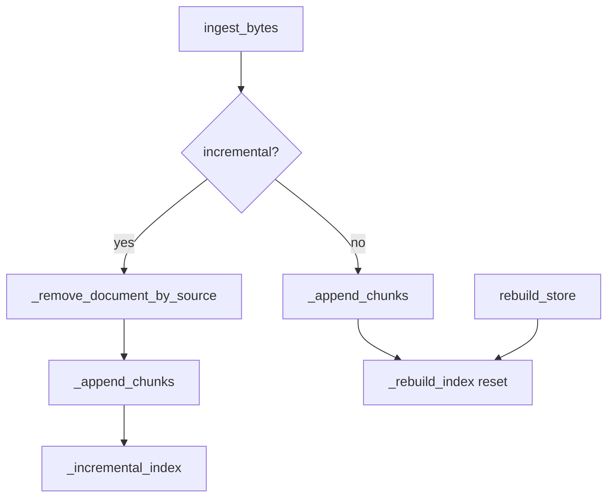
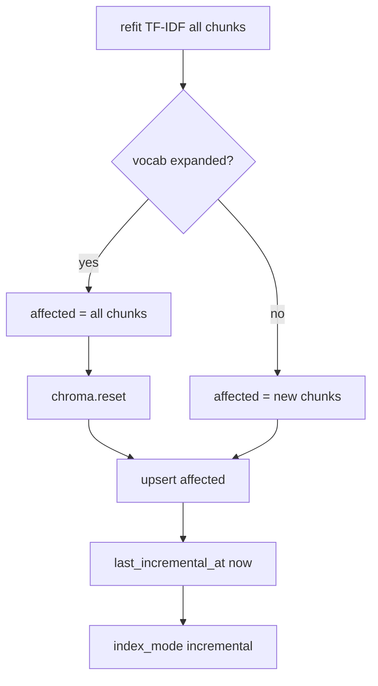
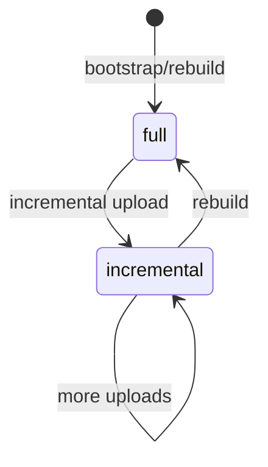
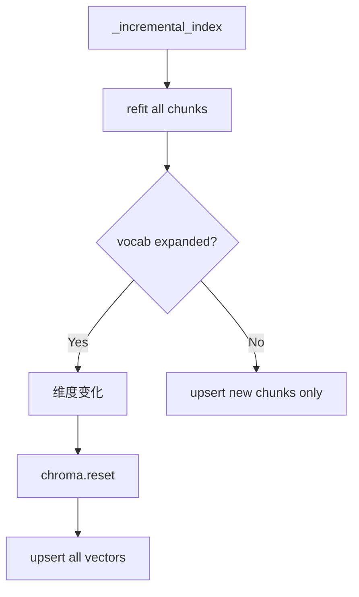

# Day 30 架构设计 — 双路径索引

## 1. 路径分流



## 2. _incremental_index 内部



## 3. 状态机 index_mode



## 4. 组件职责

| 组件 | 职责 |
|------|------|
| knowledge_incremental.py | IncrementalReport 数据类 |
| knowledge_store._incremental_index | 核心算法 |
| knowledge_store._remove_document_by_source | 同名清理 |
| chroma_store.delete_* | 向量删除 |
| api/knowledge upload | 默认 incremental 响应 |

## 5. 不变量

任意时刻 `chroma_count == chunk_count`（空库除外）。

---

## 6. TF-IDF 扩张在架构中的位置



这是 Day30 **唯一**调用 reset 的 upload 路径。

---

## 7. 数据流：IncrementalReport

API 层在 upload 成功后可选调用 `incremental_upload(...)` 构造报告，含 `vocab_expanded` 供前端展示「已重建索引」toast。

---

## 8. 并发模型（讨论）

多 worker 同时 incremental upload 可能 race TF-IDF refit。教学单进程；生产需文件锁或队列。

---

## 9. 分层架构图

```
┌─────────────────────────────────────────────┐
│ Presentation: FastAPI upload / status        │
├─────────────────────────────────────────────┤
│ Application: KnowledgeStore ingest_*         │
├─────────────────────────────────────────────┤
│ Domain: _incremental_index / remove          │
├─────────────────────────────────────────────┤
│ Infrastructure: ChromaVectorIndex / JSON   │
└─────────────────────────────────────────────┘
```

---

## 10. 扩张检测逻辑形式化

```
vocab_expanded ≡ (|V_new| > |V_old|) ∧ (V_old ≠ ∅)
```

其中 V_old 来自本次 refit 前 `embedding_state` 快照，V_new 来自 refit 后 `export_state()`。

---

## 11. 失败恢复序列

1. upsert 抛错 → 记录日志  
2. status chroma_count ≠ chunk_count  
3. 运维 `POST rebuild`  
4. 验证 index_mode=full  

---

## 12. 与 CQRS 类比

upload 是 Command（写），chat 是 Query（读）。增量写路径优化不影响读接口。扩张时短暂不一致窗口类似 CQRS 最终一致。

---

## 13. 架构权衡记录

| 决策 | 备选 | 选择理由 |
|------|------|----------|
| 扩张全 upsert | 双 collection | 简单 |
| 同步索引 | 队列 | 教学清晰 |
| TF-IDF | 神经网络 | 无外部依赖 |
| mock reset 测试 | 集成测试耗时 | 快速反馈 |
