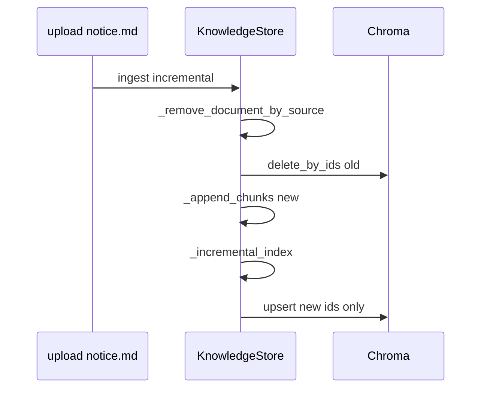
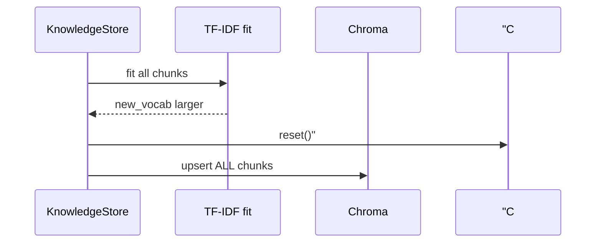

# Day 30 流程图与示意图

## 同名 re-upload



## vocab 扩张



## ASCII：扩张决策

```
len(new_vocab) > len(old_vocab) and old_vocab non-empty?
    YES → reset + upsert(all)
    NO  → upsert(affected only)
```

---

## 状态时间线（ASCII）

```
t0: rebuild        index_mode=full
t1: upload doc A   incremental, no reset
t2: upload doc A'  incremental, remove+upsert
t3: upload doc B   incremental (new vocab?) 
t4: rebuild        full again
```

---

## 组件图

```
┌─────────────────────────────────────┐
│         KnowledgeStore               │
│  ingest_bytes ──► incremental path   │
│  rebuild_store ─► _rebuild_index     │
└──────────────┬──────────────────────┘
               │
       ┌───────┴────────┐
       ▼                ▼
 _incremental_index   chroma.reset (扩张/rebuild)
       │
       ▼
 chroma.upsert_chunks
```

---

## 10. 错误路径（故意触发）

| 操作 | 预期错误/行为 |
|------|----------------|
| upsert 维不一致 | chromadb 异常 |
| remove 不删 chroma | count 不等 |
| 跳过 refit | 检索分数异常 |
