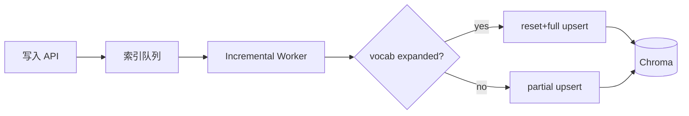

# 深度扩展：索引更新策略

## CDC vs Batch

| 模式 | 延迟 | 复杂度 |
|------|------|--------|
| CDC 流式 | 低 | 高 |
| 批量 rebuild | 高 | 低 |
| 增量 upsert | 中 | 中 |

NexusAgent Day 30 属「增量 upsert + 定期 rebuild」混合。

## Lucene 段合并类比

Chroma HNSW 图增量插入后结构变化；极端情况下需 rebuild 图。TF-IDF 扩张类似「改字段类型必须 reindex」。

## 版本向量

工业界用「embedding 模型版本号」+ 全量重建任务；我们用在 `embedding_state` 隐式版本（vocab 内容）。

---

## 近实时索引架构（扩展阅读）

NexusAgent 当前同步执行，无异步队列；上图为 Phase 4 演进方向。

---

## Debezium / CDC 对照

数据库 CDC 捕获行级变更；知识库 upload 是文件级变更。`_remove_document_by_source` 类似 CDC delete 事件；`_append_chunks` 类似 insert。

---

## 批量 vs 流式权衡表

| 策略 | 延迟 | 一致性 | 实现 |
|------|------|--------|------|
| Day28 rebuild | 高 | 强 | 简单 |
| Day30 incremental | 低 | 强* | 中等 |
| 异步队列 | 最低 | 最终 | 复杂 |

*扩张时短暂 reset 窗口内查询可能空，教学环境单用户可忽略。
