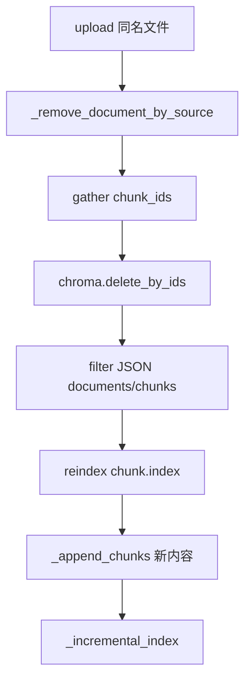

# 同名替换与删除策略

## 流程

1. 用户 upload `notice.md`（第二次）  
2. `_remove_document_by_source("notice.md")`  
3. Chroma `delete_by_ids` 旧 chunk_id 列表  
4. filter documents/chunks  
5. `_append_chunks` 新块  
6. `_incremental_index`  

## 注意

filename 作 source 键，须与 upload 文件名一致。路径遍历上传需规范化 name。

## delete_by_source 备用

当 ids 查询失败时 `delete(where={"source": filename})` 兜底。

---

## 同名冲突场景

| 场景 | 行为 |
|------|------|
| notice.md 再传 | 替换 |
| Notice.md vs notice.md | 需规范化大小写 |
| uploads/a.md 与 b.md 不同名 | 并存 |

---

## chunk_id 变化

re-upload 后 chunk_id 可能重新生成（取决于 chunker）。故必须 delete **旧** ids，不能假设 id 不变。

---

## 事务性讨论

理想：Chroma delete 与 JSON filter 同一事务。当前顺序执行，失败中间态应 rebuild 修复。

---

## 完整 remove 源码

见 `22_knowledge_incremental精读.md` 第三节；本文件不重复贴码，避免与走查重复。

---

## 练习

手写单元测试：remove 后 `chroma.count()` 减少量等于 `len(removed_ids)`。

---

## 删除策略决策树

---

## metadata source 与 filename 契约

`TextChunk.source` 必须等于 `KnowledgeDocument.name` 等于 upload 的 `filename`。任一不一致会导致 remove 删不干净。

---

## 运维：手动删除文档（无 API）

1. 从 JSON 找到 filename  
2. `store._remove_document_by_source(filename)`  
3. `store.save()`  
4. 验证 chroma_count  

---

## 与 GDPR「删除权」讨论

若用户要求删除文档，当前需编程调用 remove；未来 Day+ 可暴露 DELETE API。增量路径下 remove 是子集操作。
