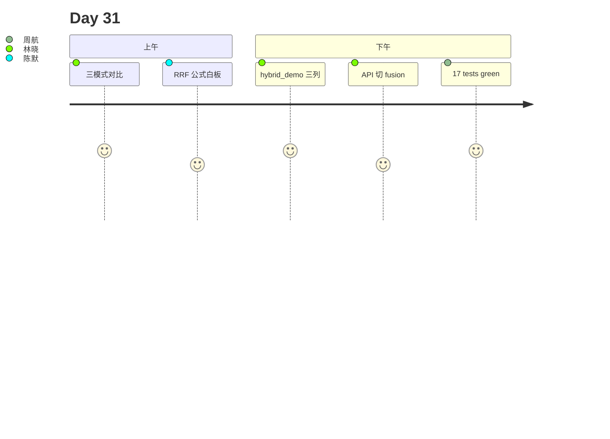

# Day 31 旁白解读

2026 年 8 月 7 日，星期五。林晓在客服工单里看到一条投诉：「机器人答不出理财经理电话 13900001111。」她切到纯向量模式复现——top-1 落在「风险提示」段落，手机号 chunk 排到第 7。

陈默在白板写下两行：

| 检索腿 | 擅长 | 短板 |
|--------|------|------|
| 关键词 | 精确 token、SKU、号码 | 同义改写 |
| 向量 | 语义、口语 | 稀有数字串 |

赵岩：「Day 30 让公告秒进库，今天让库**答得准**。」

下午 Lab 第三节，林晓跑 `hybrid_demo.py`，同一问句三列输出：vector 偏语义、keyword 命中号码、hybrid 把号码 chunk 顶到第一。全班盯着 `fusion=rrf` 与 `weighted` 的分差讨论——周航说：「RRF 不吵架，各看排名。」

第四节高潮：她 `PUT /api/knowledge/retrieval-config` 把 fusion 改成 `rrf`，再 `POST /api/chat`，客服场景立刻好转。陈默：「检索不是越新越好，是**两条腿走路**。」

**金句**：陈默：「向量懂意思，关键词认号码；融合不是妥协，是工程上的成年人选择。」

---

## 技术旁白：pool 为何是 top_k×4

`HybridRetriever.search` 在 hybrid 模式先各取 `pool = max(top_k * 4, 8)` 条候选，再融合截断到 `top_k`。池子太小会漏掉「一路排前、一路排后」的互补块；太大则浪费。8 是教学库的下限保底。

---

## 现场对话（转写节选）

**学员**：能否永远 keyword_weight=1？  
**陈默**：可以 `mode=keyword`，但「年化收益怎么样」类问句会掉召回。hybrid 是默认平衡点。

**学员**：RRF 的 k 是什么？  
**陈默**：`rrf_k=60` 是经典默认，越大排名靠后的贡献越平滑。

---

## 林晓日记节选

「昨天还在纠结 reset 几次，今天纠结 fusion 用 weighted 还是 rrf。原来检索质量是另一条战线。」

---

## 时间线

| 时刻 | 事件 |
|------|------|
| 09:00 | 复现手机号 vector miss |
| 10:30 | 讲 RetrievalConfig |
| 11:00 | **RRF 白板推导** |
| 14:00 | hybrid_demo 三模式 |
| 15:00 | API retrieval-config |
| 16:30 | 17 tests green |

---

## 媒体稿（公关）

智链 NexusAgent v0.31.0 上线混合检索，FAQ 对精确产品编号与客户电话的命中率显著提升，同时保持口语化咨询的语义理解能力。

---

## 幕后：教研组会议纪要

**议题**：默认 weighted 还是 rrf？  
**结论**：weighted 0.35/0.65 与历史向量偏好一致；文档推荐 SKU 场景试 RRF。  
**行动**：Day31 课件 Lab4 强制对比两种 fusion。

---

## 学员反馈（试讲）

「终于理解为什么客服爱贴号码 —— 那是 keyword 腿的主场。」  
「RRF 公式比想象中简单，难在理解 pool。」

---

## 彩蛋：电影隐喻

陈默：「向量像懂你在找什么感觉；关键词像认身份证号。破案要两个侦探合作。」
