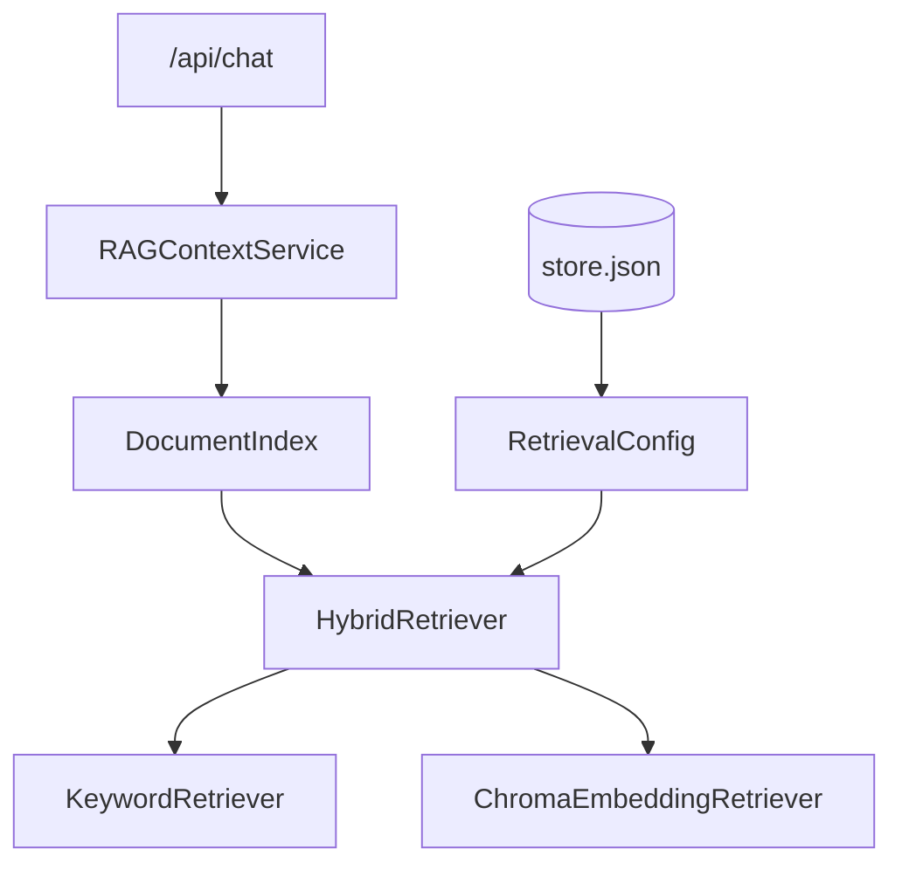
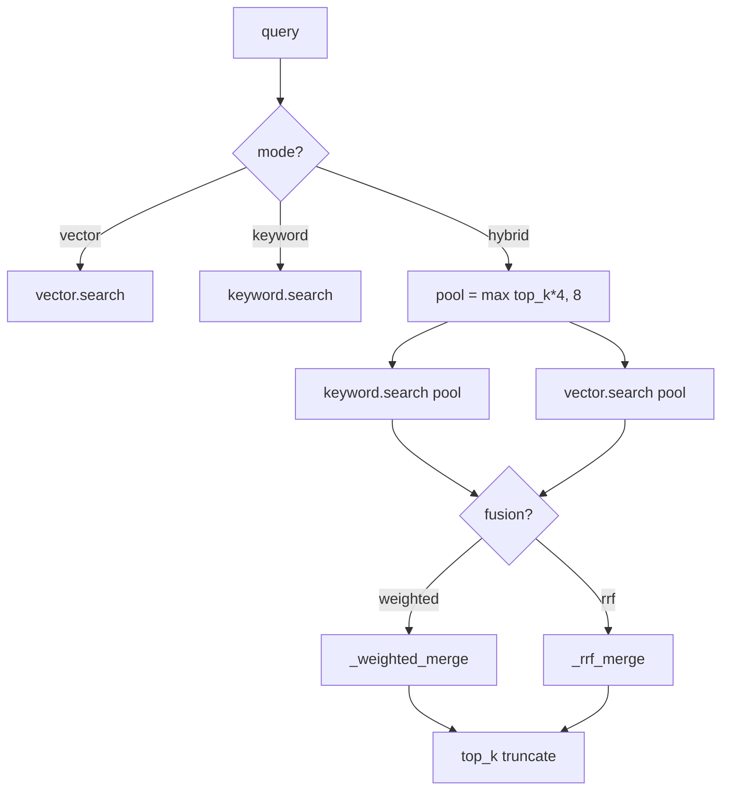
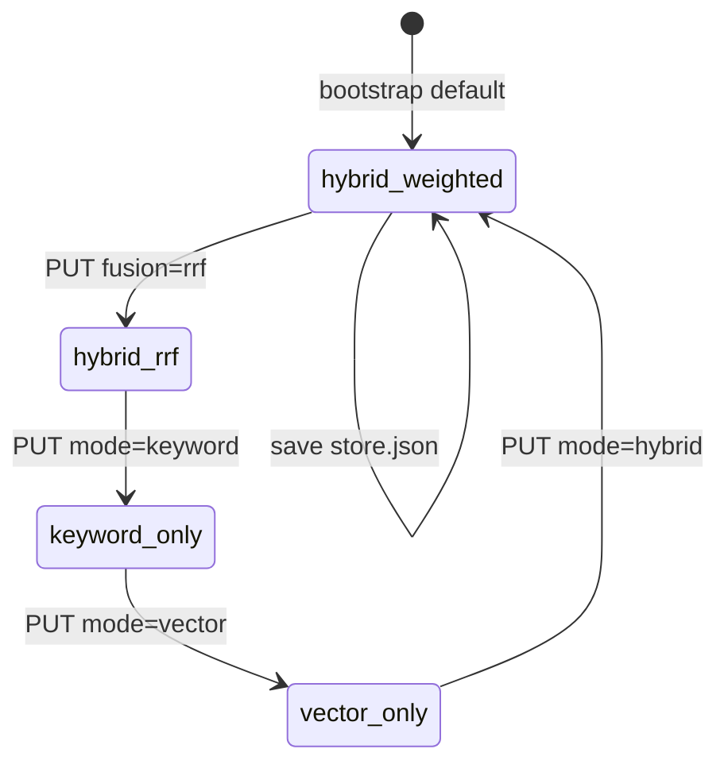
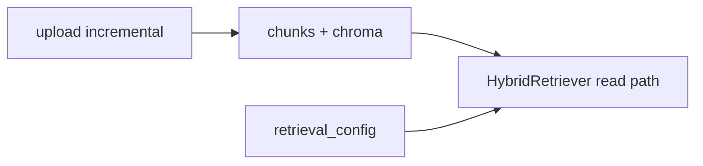

# Day 31 架构设计 — 混合检索层

## 1. 检索栈分层



## 2. search 分流



## 3. 配置生命周期



## 4. 组件职责

| 组件 | 职责 |
|------|------|
| hybrid_retriever.py | 三模式 search + 融合函数 |
| retrieval_config.py | 配置 dataclass + validate |
| knowledge_store._build_rag_service | 装配双检索器 |
| api/knowledge retrieval-config | REST 读写配置 |
| day31/hybrid_demo.py | CLI 三模式对比 |

## 5. 不变量

- 任意模式返回 `list[RetrievalResult]`，元素含 `chunk` / `score` / `matched_tokens`  
- hybrid 融合后 score 仅用于排序，不跨请求比较绝对值（RRF 已归一化到 max）  

---

## 6. 与 Day30 增量正交



写入路径不变；读取路径新增融合层。

---

## 7. 数据流：PUT retrieval-config

1. `RetrievalConfig.from_dict(body)`  
2. `validate()`  
3. `store.set_retrieval_config(cfg)`  
4. `store.save()`  
5. 下次 `as_rag_service()` 读新 config  

---

## 8. 并发模型（讨论）

多 worker 同时 PUT 配置可能 last-write-wins。教学单进程；生产可加乐观锁版本号。

---

## 9. 分层架构图

```
┌─────────────────────────────────────────────┐
│ Presentation: GET/PUT retrieval-config       │
├─────────────────────────────────────────────┤
│ Application: KnowledgeStore.get/set config   │
├─────────────────────────────────────────────┤
│ Domain: HybridRetriever.search               │
├─────────────────────────────────────────────┤
│ Infrastructure: Keyword + Chroma retrievers  │
└─────────────────────────────────────────────┘
```
