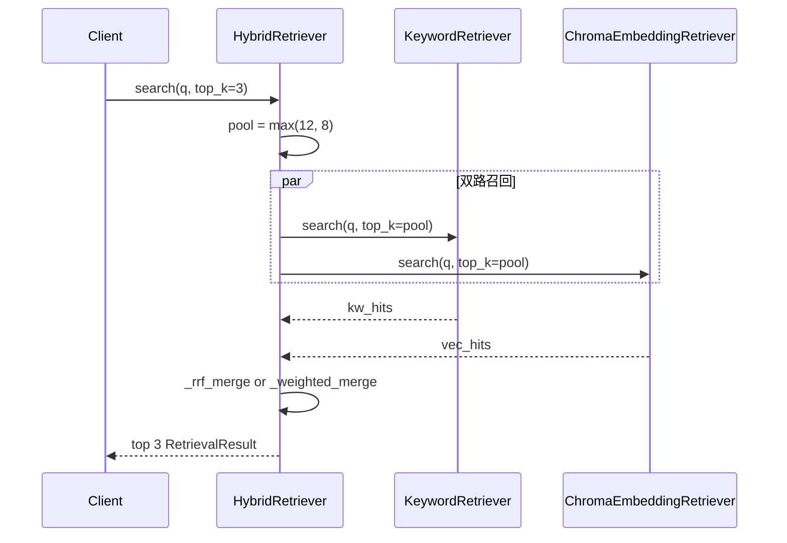
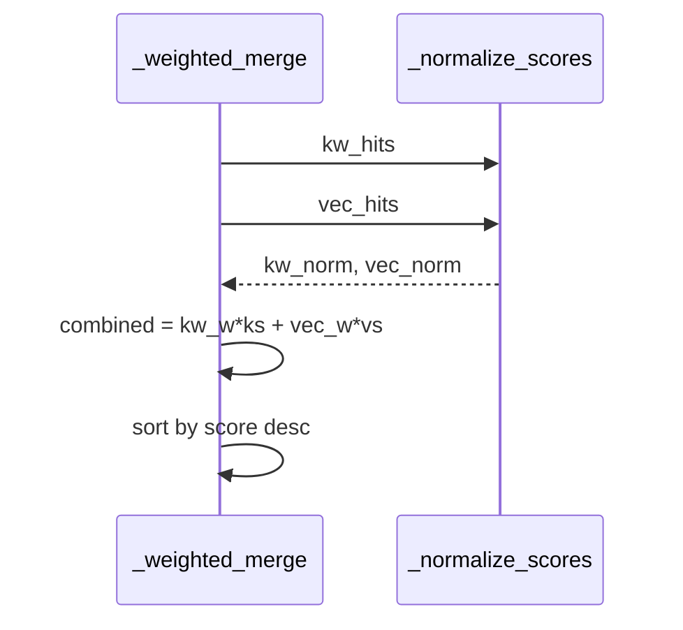

# Day 31 流程图与示意图

## hybrid search 时序



## weighted 融合数据流



## ASCII：模式选择

```
query ──► mode?
            ├─ vector  ──► vector.search ──► return
            ├─ keyword ──► keyword.search ──► return
            └─ hybrid  ──► dual pool ──► fuse ──► top_k
```

---

## API 配置流（ASCII）

```
GET  /retrieval-config  ◄── store.get_retrieval_config()
PUT  /retrieval-config  ──► validate ──► set ──► save()
POST /api/chat          ──► as_rag_service() ──► HybridRetriever
```

---

## 组件图

```
┌─────────────────────────────────────┐
│         KnowledgeStore               │
│  _build_rag_service                  │
│    ├─ KeywordRetriever               │
│    ├─ ChromaEmbeddingRetriever       │
│    └─ HybridRetriever(config)        │
└──────────────┬──────────────────────┘
               │
       ┌───────┴────────┐
       ▼                ▼
 retrieval_config   chroma + chunks
```

---

## 错误路径

| 操作 | 预期 |
|------|------|
| PUT mode=invalid | 422 |
| search("") | [] |
| hybrid 无 chunk | [] |
| rrf_k=0 validate | ValueError |
