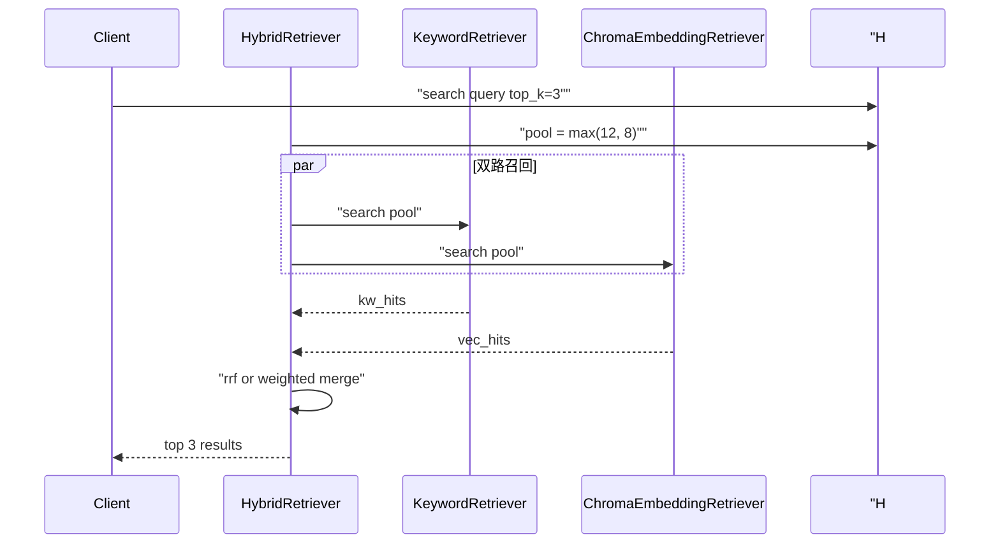
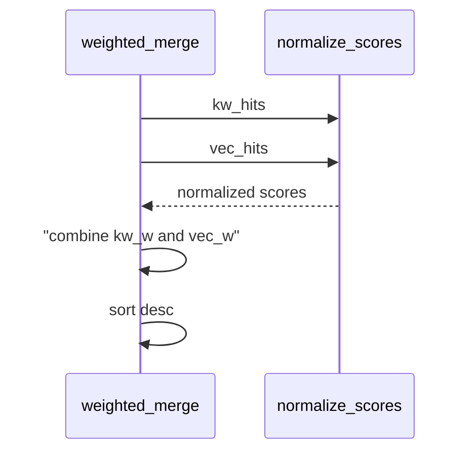

# Day 31 流程图与示意图

## hybrid search 时序



## weighted 融合数据流



## ASCII：模式选择

```
query ──► mode?
            ├─ vector  ──► vector.search ──► return
            ├─ keyword ──► keyword.search ──► return
            └─ hybrid  ──► dual pool ──► fuse ──► top_k
```

## API 配置流

```
GET  /retrieval-config  ◄── store.get_retrieval_config()
PUT  /retrieval-config  ──► validate ──► set ──► save()
POST /api/chat          ──► HybridRetriever
```
