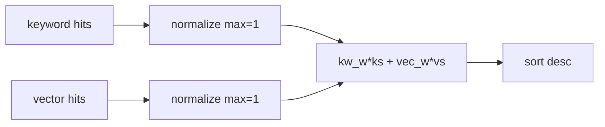
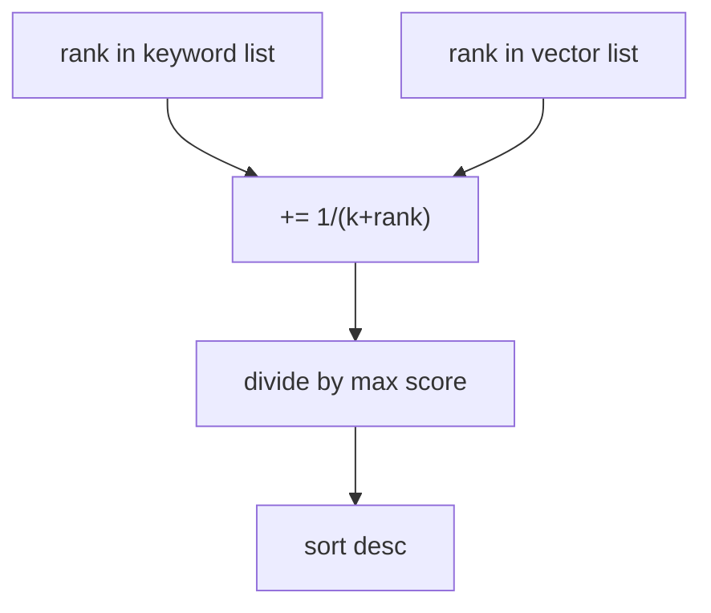

# 混合检索详解（Day 31 专题）

## 1. 问题定义

混合检索 = 在同一份 chunk 索引上，并行（或择一）执行稀疏与稠密召回，再融合排序。

## 2. 三模式对照

| mode | 行为 | 适用 |
|------|------|------|
| vector | 仅 cosine 相似度 | 探索、语义 FAQ |
| keyword | 仅 token 匹配 | 审计、精确编号 |
| hybrid | 双路 + 融合 | **生产默认** |

## 3. 融合算法

### 3.1 Weighted（默认）



公式：`combined(d) = w_k * norm_k(d) + w_v * norm_v(d)`

默认 `w_k=0.35, w_v=0.65` 略偏语义，因口语 query 占比高。

### 3.2 RRF



**优点**：不依赖分数标定；一路 BM25 式大分、一路 cosine 小分也能融合。  
**缺点**：丢失绝对置信度；tie-break 靠 `chunk.index`。

### 3.3 选型指南

| 信号 | 建议 |
|------|------|
| 两路分数尺度未知 | RRF |
| 有离线评估可标权重 | weighted |
| 精确 query 占比 >40% | 提高 keyword_weight 或 RRF |

## 4. 候选池 pool

`pool = max(top_k * 4, 8)`

**直觉**：若某 chunk 在 keyword 路排第 2、vector 路排第 20，pool 至少 20 才能进融合。4× 是经验系数；8 防止 top_k=1 时 pool=4 过小。

## 5. matched_tokens 合并

RRF 合并时保留 keyword 的 matched_tokens，并追加 vector 腿 token（去重）。便于 debug「为何这条排前」。

## 6. 与 Day30 关系

增量索引更新 chunk 与向量；HybridRetriever **只读** chunks 与 config，不改索引。

## 7. 常见误区

| 误区 | 正解 |
|------|------|
| hybrid = 平均两路原始分 | 须归一化或 RRF |
| RRF 的 k 越大越好 | 过大则排名区分度下降 |
| mode=hybrid 必比 vector 好 | 极端权重或坏库仍会失败 |

## 8. 数学例题

keyword 路：A rank1 score 100，B rank2 score 10。vector 路：B rank1 score 0.9，A 未进 top。`rrf_k=60`，问融合后谁前？

A: 1/61 ≈ 0.0164；B: 1/62 + 1/61 ≈ 0.0325 → **B 胜**。

## 9. 课堂演示

运行 hybrid_demo，对比 `13900001111` 三列。

## 10. 小结

混合检索三层含义：**双路召回**（互补）、**分数融合**（可比）、**可配置**（运营可调）。

---

## 11. 工作负载

设 pool=P，keyword 与 vector 各 O(P) 检索 + O(P) 融合 → hybrid ≈ 2× 单路。NFR-001 要求 P95 < 200ms。

---

## 12. RetrievalConfig JSON 示例

```json
{
  "mode": "hybrid",
  "keyword_weight": 0.35,
  "vector_weight": 0.65,
  "fusion": "weighted",
  "rrf_k": 60
}
```

---

## 13. 白板证明：为何号码偏 keyword

数字串在 TF-IDF / bag-of-token 中具唯一性；embedding 空间中对「13900001111」与「13900002222」距离可能很近 → vector 腿不稳定。

---

## 14. 端到端数值例题

top_k=3，pool=12。keyword 返回 8 条，vector 12 条，交集 5 条。问：融合结果最多几条？  
**答**：最多 15 条去重后再截 3。

---

## 15. 监控建议

- `hybrid_search_ms` histogram  
- `fusion_mode` gauge  
- 精确 query 集 hit@1 日报  

---

## 16. 与 Elasticsearch 混合检索对照

| ES | NexusAgent |
|----|------------|
| BM25 + dense_vector | Keyword + Chroma |
| RRF 插件 | _rrf_merge |
| 索引分离 | 同 chunk 双索引 |

---

## 17. 产品话术

「系统同时理解您话里的意思和您输入的精确编号，并智能合并两种搜索结果。」

---

## 18. 单元测试设计

- 测 helper：`_rrf_merge`、`_weighted_merge`  
- 测模式：vector/keyword 早返回  
- 测集成：store 持久化 config  

---

## 19. 反模式

在融合前对两路结果 **concat 去重不评分** — 丢失排序信息，hit@1 下降。

---

## 20. Phase 4 展望

引入 BM25 替换 KeywordRetriever；融合层接口不变。Day 32 rerank 在融合后再精排 top-20。

---

## 21. 完整 hybrid_retriever 源码（专题附录）

```python
"""
混合检索器 — 关键词 + 向量分数融合

将 KeywordRetriever（稀疏命中）与 ChromaEmbeddingRetriever（稠密相似度）
按加权或 RRF 合并，改善精确词与语义问句的召回平衡。

需求：ZL-NA-REQ-031
"""

from __future__ import annotations

from rag.chunker import TextChunk
from rag.chroma_retriever import ChromaEmbeddingRetriever
from rag.embedding_retriever import EmbeddingRetriever
from rag.retrieval_config import (
    FUSION_RRF,
    FUSION_WEIGHTED,
    MODE_HYBRID,
    MODE_KEYWORD,
    MODE_VECTOR,
    RetrievalConfig,
)
from rag.retriever import KeywordRetriever, RetrievalResult


class HybridRetriever:
    """
    混合检索器 — 统一 search() 接口

    典型用法：
        cfg = RetrievalConfig(mode="hybrid", fusion="rrf")
        retriever = HybridRetriever(chunks, keyword, vector, config=cfg)
        hits = retriever.search("最低起购金额", top_k=3)
    """

    def __init__(
        self,
        chunks: list[TextChunk],
        keyword: KeywordRetriever,
        vector: ChromaEmbeddingRetriever | EmbeddingRetriever,
        *,
        config: RetrievalConfig | None = None,
    ) -> None:
        self._chunks = list(chunks)
        self._keyword = keyword
        self._vector = vector
        self._config = config or RetrievalConfig()

    @property
    def chunk_count(self) -> int:
        return len(self._chunks)

    @property
    def config(self) -> RetrievalConfig:
        return self._config

    def search(self, query: str, *, top_k: int = 3) -> list[RetrievalResult]:
        query = (query or "").strip()
        if not query or not self._chunks:
            return []

        cfg = self._config
        if cfg.mode == MODE_VECTOR:
            return self._vector.search(query, top_k=top_k)
        if cfg.mode == MODE_KEYWORD:
            return self._keyword.search(query, top_k=top_k)

        pool = max(top_k * 4, 8)
        kw_hits = self._keyword.search(query, top_k=pool)
        vec_hits = self._vector.search(query, top_k=pool)
        if cfg.fusion == FUSION_RRF:
            merged = _rrf_merge(kw_hits, vec_hits, rrf_k=cfg.rrf_k)
        else:
            merged = _weighted_merge(
                kw_hits,
                vec_hits,
                keyword_weight=cfg.keyword_weight,
                vector_weight=cfg.vector_weight,
            )
        return merged[: max(1, top_k)]


def _weighted_merge(
    kw_hits: list[RetrievalResult],
    vec_hits: list[RetrievalResult],
    *,
    keyword_weight: float,
    vector_weight: float,
) -> list[RetrievalResult]:
    """按归一化分数加权求和"""
    kw_norm = _normalize_scores(kw_hits)
    vec_norm = _normalize_scores(vec_hits)
    by_id: dict[str, RetrievalResult] = {}

    for r in kw_hits:
        by_id[r.chunk.chunk_id] = r
    for r in vec_hits:
        by_id.setdefault(r.chunk.chunk_id, r)

    scored: list[RetrievalResult] = []
    for chunk_id, base in by_id.items():
        ks = kw_norm.get(chunk_id, 0.0)
        vs = vec_norm.get(chunk_id, 0.0)
        combined = keyword_weight * ks + vector_weight * vs
        if combined <= 0:
            continue
        matched = tuple(dict.fromkeys((*base.matched_tokens,)))
        scored.append(
            RetrievalResult(
                chunk=base.chunk,
                score=combined,
                matched_tokens=matched,
            )
        )
    scored.sort(key=lambda r: (-r.score, r.chunk.index))
    return scored


def _rrf_merge(
    kw_hits: list[RetrievalResult],
    vec_hits: list[RetrievalResult],
    *,
    rrf_k: int,
) -> list[RetrievalResult]:
    """Reciprocal Rank Fusion — 不依赖原始分数尺度"""
    scores: dict[str, float] = {}
    chunks: dict[str, TextChunk] = {}
    tokens: dict[str, tuple[str, ...]] = {}

    for rank, r in enumerate(kw_hits, start=1):
        cid = r.chunk.chunk_id
        scores[cid] = scores.get(cid, 0.0) + 1.0 / (rrf_k + rank)
        chunks[cid] = r.chunk
        tokens[cid] = r.matched_tokens

    for rank, r in enumerate(vec_hits, start=1):
        cid = r.chunk.chunk_id
        scores[cid] = scores.get(cid, 0.0) + 1.0 / (rrf_k + rank)
        chunks[cid] = r.chunk
        if r.matched_tokens:
            prev = tokens.get(cid, ())
            tokens[cid] = tuple(dict.fromkeys((*prev, *r.matched_tokens)))

    max_rrf = max(scores.values()) if scores else 1.0
    results = [
        RetrievalResult(
            chunk=chunks[cid],
            score=scores[cid] / max_rrf,
            matched_tokens=tokens.get(cid, ()),
        )
        for cid in scores
    ]
    results.sort(key=lambda r: (-r.score, r.chunk.index))
    return results


def _normalize_scores(hits: list[RetrievalResult]) -> dict[str, float]:
    if not hits:
        return {}
    max_s = max(r.score for r in hits) or 1.0
    return {r.chunk.chunk_id: r.score / max_s for r in hits}
```


---

## 22. weighted 数值走查例题

keyword 路：D1 score=8, D2 score=4。vector 路：D2 score=0.9, D3 score=0.3。权重 0.5/0.5。

归一化后：D1 kw=1, D2 kw=0.5, D2 vec=1, D3 vec=0.33。  
D2 combined=0.5×0.5+0.5×1=0.75 最高。

---

## 23. 课堂 10 分钟：何时切 keyword-only

临时活动仅查编号可 `mode=keyword`；活动结束务必恢复 hybrid。记录 incident 模板。

---

## 24. 与 query rewrite 边界

Rewrite 改 query 文本；fusion 改排序。Day32+ 可串联：rewrite → hybrid → rerank。

---

## 25. 监控大盘建议

- hit@1 按 query 类型分桶（精确/语义）  
- fusion 切换事件计数  
- hybrid P95 延迟  

---

## 26. 安全：检索模式泄露

status 暴露 mode 无敏感信息；勿在 retrieval-config 返回内部路径。

---

## 27. 批量评估伪代码

```python
for q in eval_queries:
    for mode in ("vector", "keyword", "hybrid"):
        hits = retriever.search(q, top_k=5)
        log_hit_at_k(q, mode, hits, gold)
```

---

## 28. 产品 FAQ 五条

**Q 混合检索是什么？** 同时用关键词和语义找资料再合并。  
**Q 默认模式？** hybrid。  
**Q 如何调？** PUT retrieval-config。  
**Q 会影响上传吗？** 不会，只影响查询。  
**Q 明天学什么？** rerank 精排。

---

## 29. 专题小结金句

「召回靠腿，融合靠脑；RRF 是排名民主，weighted 是分数加权民主。」
