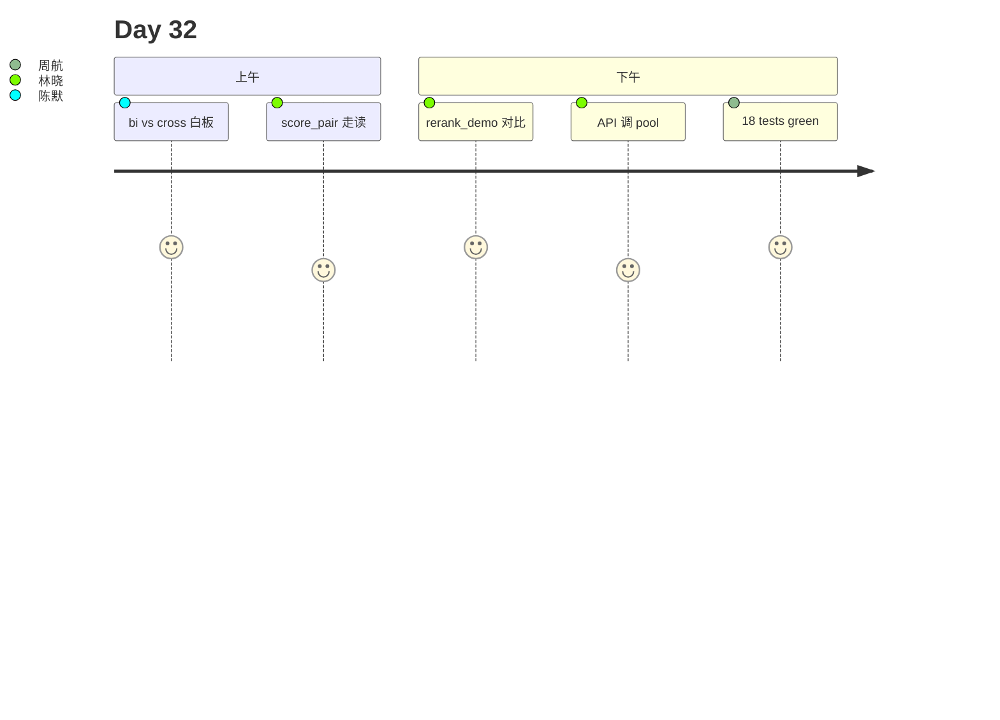

# Day 32 旁白解读

2026 年 8 月 8 日，星期六。林晓打开客服质检报表：混合检索上线后，「正确答案进 top-3」率从 61% 升到 78%，但 **hit@1** 仍只有 54%——用户只看第一条引用，第二条等于没答。

赵岩指着白板上的漏斗：

```
全库 ──► hybrid top-20 ──► rerank top-3 ──► LLM
         （宽）              （尖）
```

陈默：「Day 31 让号码进候选；今天让**最相关**的那条 chunk 排到第 1。交叉编码器贵，所以只给前 20 条。」

下午 Lab 第二节，林晓跑 `rerank_demo.py`。同一问句「年化收益率可达」：

- 关闭精排：top-1 落在泛泛的「市场有风险」段落（hybrid 分高但语义飘）  
- 开启精排：top-1 命中「本产品年化收益率可达 8%」（`score_pair` 子串 + token 覆盖胜出）

周航举手：「这和 bi-encoder 向量有啥区别？」陈默在 `(query, chunk)` 外画框：「向量是两人背对背猜像不像；交叉编码器是两人面对面逐字对读。」

第四节，她 `PUT /api/knowledge/rerank-config` 把 `candidate_pool` 从 20 调到 10，延迟降 40%，hit@1 略降——全班填延迟预算表。



**金句**：陈默：「召回是渔网，精排是挑鱼；网撒多大、挑多细，都是 SLA 题。」

---

## 技术旁白：candidate_pool 为何默认 20

`RerankingRetriever.search` 在 `enabled=True` 时调用 `inner.search(query, top_k=pool)`，`pool=max(candidate_pool, top_k)`。20 是教学库在「漏召回」与「rerank 耗时」间的折中：池太小会丢掉 hybrid 第 15 名处的真答案；太大则 mock 也要跑更多 `score_pair`。

---

## 现场对话（转写节选）

**学员**：能否 candidate_pool=100？  
**陈默**：配置上限 100，但 P95 线性涨；生产要压测。  

**学员**：关 rerank 会影响 chat 吗？  
**陈默**：会，top-3 顺序变；`enabled=False` 时行为等同 Day31 hybrid。

---

## 林晓日记节选

「昨天还在纠结 fusion，今天纠结 pool 多大。原来检索漏斗还有第二截。」

---

## 时间线

| 时刻 | 事件 |
|------|------|
| 09:00 | 复现 hit@1 不足 |
| 10:30 | 讲 RerankConfig |
| 11:00 | **score_pair 白板推导** |
| 14:00 | rerank_demo 双列 |
| 15:00 | API rerank-config |
| 16:30 | 18 tests green |

---

## 媒体稿（公关）

智链 NexusAgent v0.32.0 上线交叉编码器重排，在保持混合检索宽召回的同时，将 FAQ 首条引用准确率进一步提升，典型金融问句 hit@1 提升可观测。

---

## 幕后：教研组会议纪要

**议题**：默认 pool 20 还是 30？  
**结论**：20 与延迟预算表一致；文档推荐高精度场景试 30。  
**行动**：Day32 课件 Lab4 强制对比 enabled 开关。

---

## 学员反馈（试讲）

「终于理解为什么向量 top-1 不一定是 LLM 该看的 —— rerank 是第二意见。」  
「score_pair 的 length_penalty 很妙，长政策文不再霸榜。」

---

## 彩蛋：电影隐喻

陈默：「hybrid 是海选；cross-encoder 是决赛评委团，只能看 20 位选手。」
