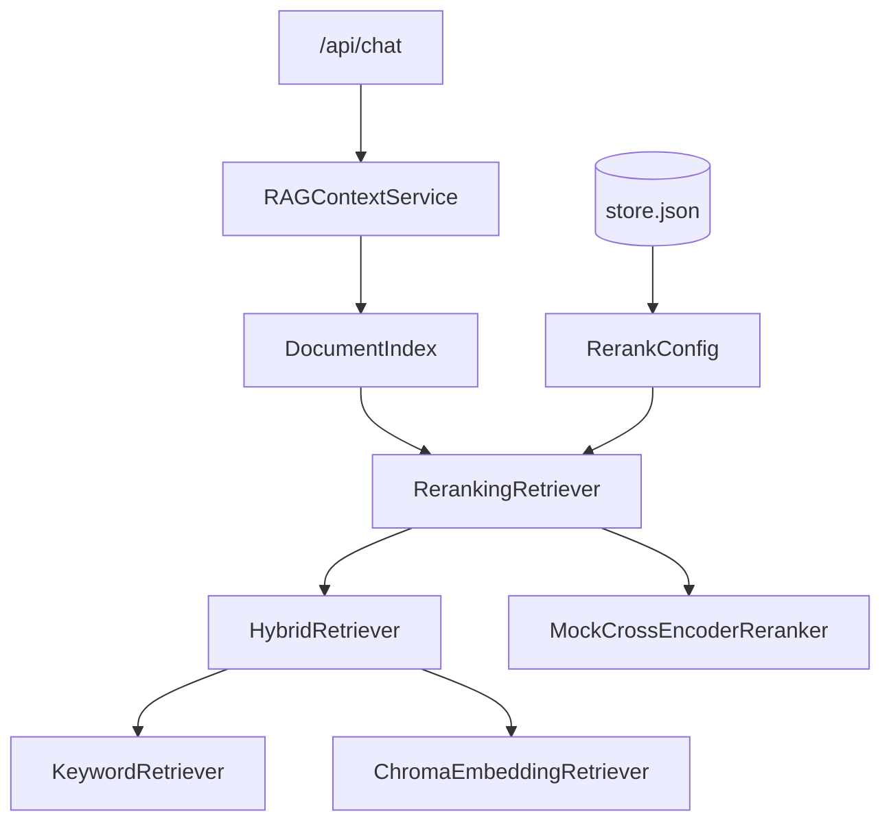
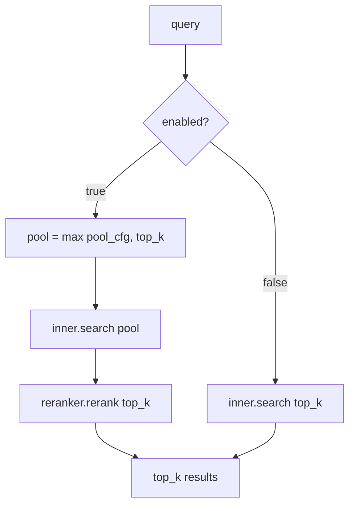
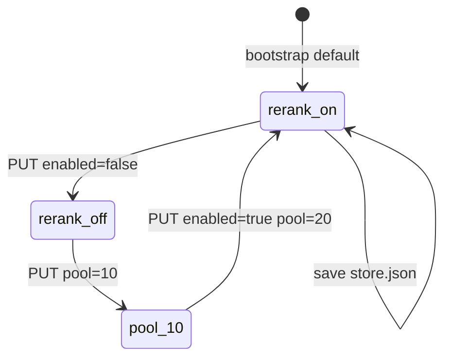
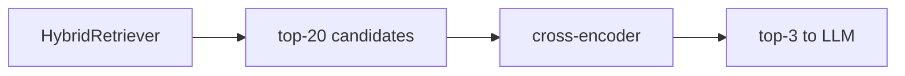

# Day 32 架构设计 — 两阶段检索层

## 1. 检索栈分层



## 2. search 分流



## 3. 配置生命周期



## 4. 组件职责

| 组件 | 职责 |
|------|------|
| reranker.py | score_pair + MockCrossEncoder |
| reranking_retriever.py | 两阶段 search |
| rerank_config.py | 配置 dataclass |
| knowledge_store._build_rag_service | Hybrid → Reranking 装配 |
| api/knowledge rerank-config | REST 读写 |
| day32/rerank_demo.py | CLI 开关对比 |

## 5. 不变量

- rerank 后 `RetrievalResult.score` 为 cross 分，**不可**与 hybrid 分跨请求比较  
- `matched_tokens` 从候选继承，rerank 不重新分词  

---

## 6. 与 Day31 叠加



Day31 配置（mode/fusion）仍作用于 inner；Day32 仅外包精排。

---

## 7. 数据流：PUT rerank-config

1. `RerankConfig.from_dict(body)`  
2. `validate()`  
3. `store.set_rerank_config(cfg)`  
4. `store.save()`  
5. `invalidate_cache()` → 下次 `as_rag_service()` 重建  

---

## 8. 分层架构图

```
┌─────────────────────────────────────────────┐
│ Presentation: GET/PUT rerank-config          │
├─────────────────────────────────────────────┤
│ Application: KnowledgeStore.get/set rerank   │
├─────────────────────────────────────────────┤
│ Domain: RerankingRetriever.search            │
├─────────────────────────────────────────────┤
│ Domain: MockCrossEncoderReranker.rerank      │
├─────────────────────────────────────────────┤
│ Infrastructure: HybridRetriever (inner)      │
└─────────────────────────────────────────────┘
```
