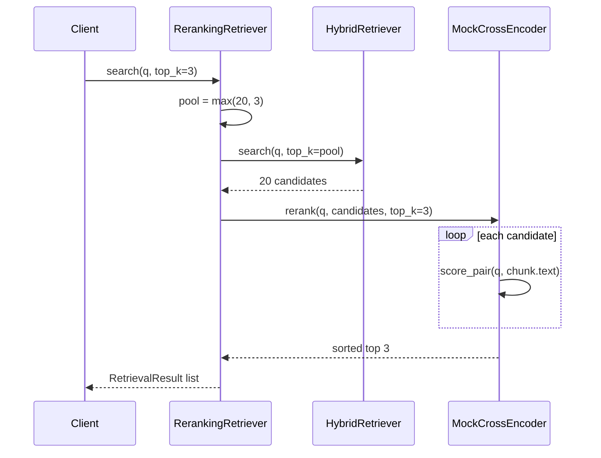
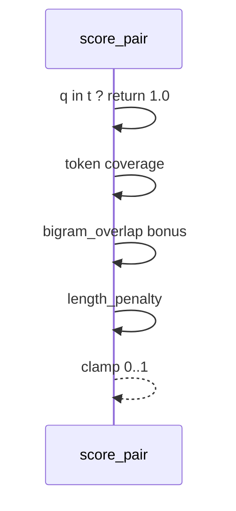

# Day 32 流程图与示意图

## rerank search 时序



## score_pair 数据流



## ASCII：两阶段漏斗

```
query ──► HybridRetriever ──► top-20 ──► CrossEncoder ──► top-3 ──► LLM
              (宽召回)                      (尖精排)
```

---

## API 配置流（ASCII）

```
GET  /rerank-config  ◄── store.get_rerank_config()
PUT  /rerank-config  ──► validate ──► set ──► save()
POST /api/chat       ──► as_rag_service() ──► RerankingRetriever
```

---

## 错误路径

| 操作 | 预期 |
|------|------|
| PUT pool=0 | 422 |
| PUT model=bert | 422 |
| search("") | [] |
| enabled=false | 等同 hybrid top_k |
