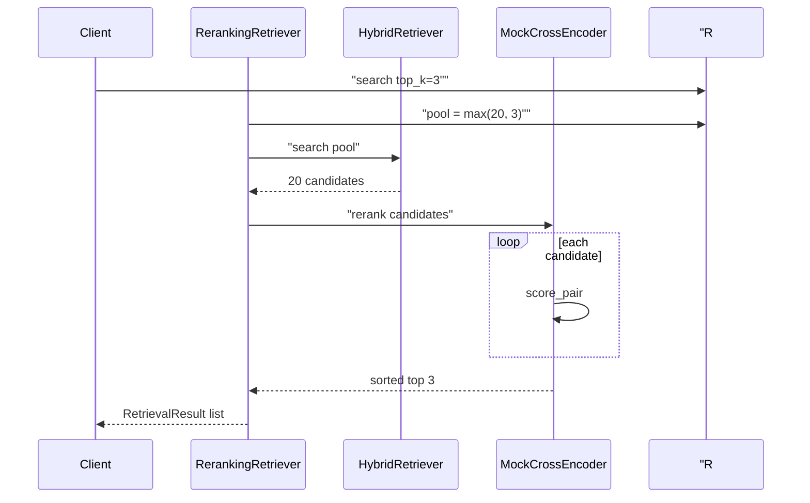
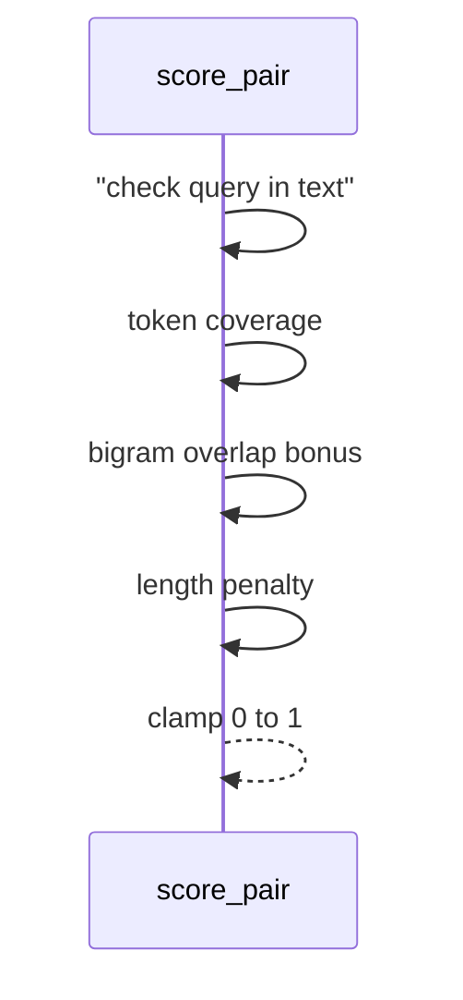

# Day 32 流程图与示意图

## rerank search 时序



## score_pair 数据流



## ASCII：两阶段漏斗

```
query ──► HybridRetriever ──► top-20 ──► CrossEncoder ──► top-3 ──► LLM
              (宽召回)                      (精排)
```

## API 配置流

```
GET  /rerank-config  ◄── store.get_rerank_config()
PUT  /rerank-config  ──► validate ──► set ──► save()
POST /api/chat       ──► RerankingRetriever
```
