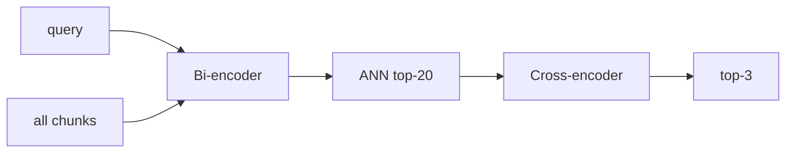

# 交叉编码器重排详解（Day 32 专题）

## 1. 问题定义

两阶段检索 = **宽召回**（hybrid top-N）+ **尖精排**（cross-encoder top-k）。Day31 解决「答案在不在候选里」；Day32 解决「谁排第一」。

## 2. Bi-encoder vs Cross-encoder

| 维度 | Bi-encoder（向量） | Cross-encoder（rerank） |
|------|-------------------|-------------------------|
| 编码 | query、doc 各一次 | (query, doc) 联合 |
| 复杂度 | O(库大小) 可 ANN | O(N) 逐对 |
| 交互 | 无细粒度 token 交互 | 有（真模型 self-attention） |
| 教学 mock | Chroma cosine | score_pair |



## 3. score_pair 公式

1. `query in text` → 1.0（精确子串）  
2. `coverage = |matched tokens| / |query tokens|`  
3. `bigram_bonus = _bigram_overlap(query, text)`  
4. `length_penalty = min(len(text)/2500, 0.12)`  
5. `raw = 0.65*coverage + 0.35*bigram - penalty`，clamp [0,1]

## 4. candidate_pool 选型

| pool | 召回风险 | rerank 成本 |
|------|----------|-------------|
| 10 | 易漏 hybrid 10 名外真答案 | 低 |
| 20 | **默认平衡** | 中 |
| 50 | 边际提升小 | 高 |

公式：`pool = max(candidate_pool, top_k)`。

## 5. enabled 开关语义

`enabled=False`：`RerankingRetriever` 直接 `inner.search(top_k)`，零 rerank 开销，行为等同 Day31。

## 6. 与 LLM 上下文

RAG 通常取 top-3 拼 prompt。hit@1 决定「第一条引用」展示；rerank 直接优化用户可见的首条来源。

## 7. 常见误区

| 误区 | 正解 |
|------|------|
| rerank 替代 hybrid | 是外包层，inner 仍是 hybrid |
| rerank 分可与 hybrid 分比 | 仅排序用，标度不同 |
| pool 越大越好 | 延迟线性，收益递减 |

## 8. 数学例题

候选 A：长政策文，hybrid score 0.95，score_pair 0.2。候选 B：短 FAQ，hybrid 0.4，score_pair 0.85。rerank 后 **B 胜**。

## 9. 课堂演示

运行 rerank_demo，对比「年化收益率可达」双列。

## 10. 小结

Rerank 三层含义：**漏斗第二截**、**query-chunk 细交互**、**可配置 SLA**（pool / enabled）。

---

## 11. 工作负载特征

| 操作 | 次数/请求 |
|------|-----------|
| hybrid search | 1 |
| score_pair | ≤ pool |
| sort | O(pool log pool) |

---

## 12. 生产演进路线

Phase 3 Day32：MockCrossEncoder  
Phase 4：ONNX / HF `BAAI/bge-reranker-base`  
Phase 5：GPU batch rerank

---

## 13. 与 ColBERT 边界

ColBERT late interaction 介于 bi 与 cross 之间；本课不展开，记为延伸阅读。

---

## 14. 监控指标建议

- `rag_rerank_pool_size`  
- `rag_rerank_latency_ms`  
- `rag_hit_at_1`（离线）  

---

## 15. 源码锚点

```python
"""
Reranking 检索管线 — hybrid 宽召回 → cross-encoder 精排

需求：ZL-NA-REQ-032
"""

from __future__ import annotations

from rag.rerank_config import RerankConfig
from rag.reranker import MockCrossEncoderReranker, Reranker
from rag.retriever import RetrievalResult


class RerankingRetriever:
    """
    两阶段检索器 — 内层负责召回，外层 reranker 负责精排

    典型用法：
        inner = HybridRetriever(...)
        retriever = RerankingRetriever(inner, config=RerankConfig())
        hits = retriever.search("年化收益率", top_k=3)
    """

    def __init__(
        self,
        inner,
        *,
        reranker: Reranker | None = None,
        config: RerankConfig | None = None,
    ) -> None:
        self._inner = inner
        self._reranker = reranker or MockCrossEncoderReranker()
        self._config = config or RerankConfig()

    @property
    def inner(self):
        return self._inner

    @property
    def config(self) -> RerankConfig:
        return self._config

    @property
    def chunk_count(self) -> int:
        return getattr(self._inner, "chunk_count", 0)

    def search(self, query: str, *, top_k: int = 3) -> list[RetrievalResult]:
        query = (query or "").strip()
        if not query:
            return []

        cfg = self._config
        if not cfg.enabled:
            return self._inner.search(query, top_k=top_k)

        pool = max(cfg.candidate_pool, top_k)
        candidates = self._inner.search(query, top_k=pool)
        if not candidates:
            return []

        return self._reranker.rerank(query, candidates, top_k=top_k)
```


---

## 16. 合规场景

风险提示类 query 须保证 top-1 来自披露原文 — rerank 的 length_penalty 降低「长文堆砌关键词」霸榜。

---

## 17. 课堂练习题

手算：query「年化」，text「本产品年化收益率可达 8%」，无完整子串，估算 coverage 与最终排序倾向。

---

## 18. 术语表

| 术语 | 含义 |
|------|------|
| hit@1 | top-1 是否含期望 token |
| candidate_pool | hybrid 召回条数上限 |
| cross-encoder | 联合编码打分模型 |

---

## 19. 反模式

- 全库 cross-encode  
- pool=1 仍开 rerank  
- 不 invalidate RAG cache 改配置  

---

## 20. 金句

「召回负责不漏，精排负责不错；Day32 专治第一条。」

---

## 21. 延迟 SLA 案例表

| 场景 | pool | rerank ms | 决策 |
|------|------|-----------|------|
| 普通 FAQ | 20 | 10 | 默认 |
| 高峰降级 | 10 | 5 | enabled 保持 |
| 事故 | — | 0 | enabled=false |

---

## 22. 与 evaluate API 关系

`/api/knowledge/evaluate` 仍隔离 chunk_config；rerank 评估应另建 hit@1 脚本，避免变量混淆。

---

## 23. 学员常见笔试错答

「rerank 用向量」— 错，用 score_pair mock cross。  
「pool 越大 hit@1 越高」— 错，边际递减且延迟升。
