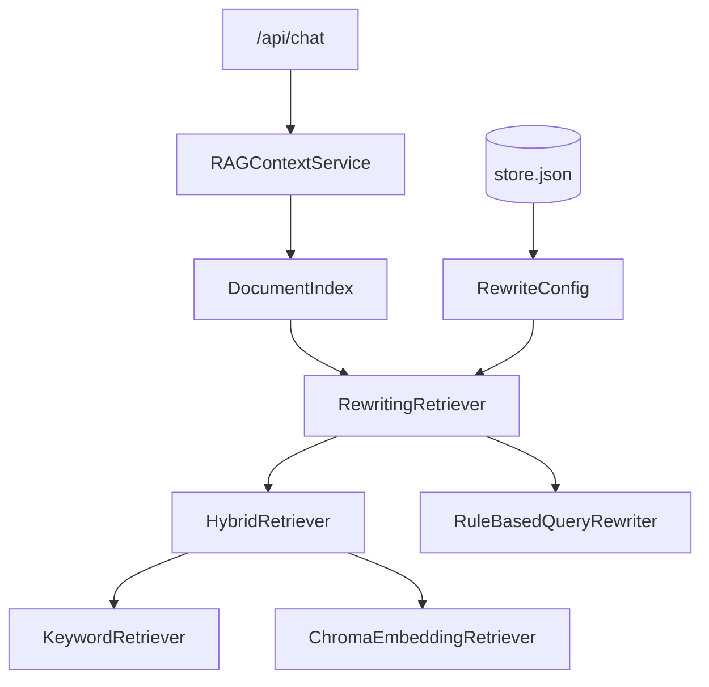
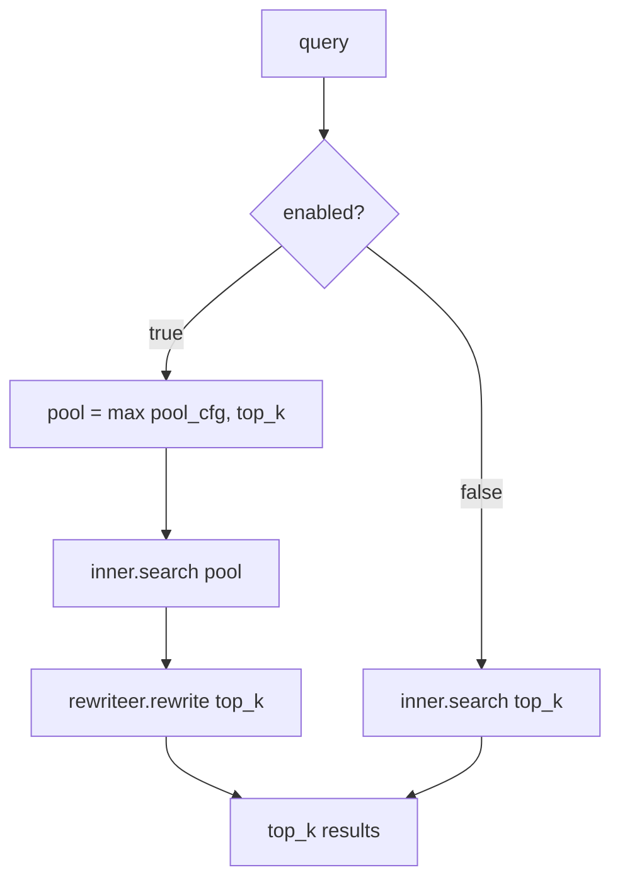
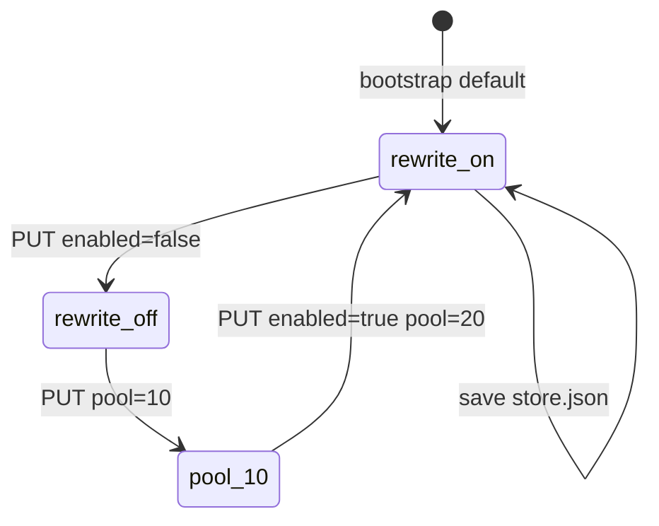
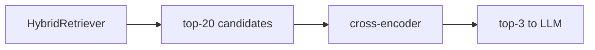

# Day 33 架构设计 — 三阶段检索层

## 1. 检索栈分层



## 2. search 分流



## 3. 配置生命周期



## 4. 组件职责

| 组件 | 职责 |
|------|------|
| rewriteer.py | rewrite + MockCrossEncoder |
| rewriteing_retriever.py | 三阶段 search |
| rewrite_config.py | 配置 dataclass |
| knowledge_store._build_rag_service | Hybrid → Rewriteing 装配 |
| api/knowledge rewrite-config | REST 读写 |
| day33/rewrite_demo.py | CLI 开关对比 |

## 5. 不变量

- rewrite 后 `RetrievalResult.score` 为 cross 分，**不可**与 hybrid 分跨请求比较  
- `matched_tokens` 从候选继承，rewrite 不重新分词  

---

## 6. 与 Day32 叠加



Day32 配置（mode/fusion）仍作用于 inner；Day34 仅外包改写。

---

## 7. 数据流：PUT rewrite-config

1. `RewriteConfig.from_dict(body)`  
2. `validate()`  
3. `store.set_rewrite_config(cfg)`  
4. `store.save()`  
5. `invalidate_cache()` → 下次 `as_rag_service()` 重建  

---

## 8. 分层架构图

```
┌─────────────────────────────────────────────┐
│ Presentation: GET/PUT rewrite-config          │
├─────────────────────────────────────────────┤
│ Application: KnowledgeStore.get/set rewrite   │
├─────────────────────────────────────────────┤
│ Domain: RewritingRetriever.search            │
├─────────────────────────────────────────────┤
│ Domain: RuleBasedQueryRewriter.rewrite      │
├─────────────────────────────────────────────┤
│ Infrastructure: HybridRetriever (inner)      │
└─────────────────────────────────────────────┘
```
