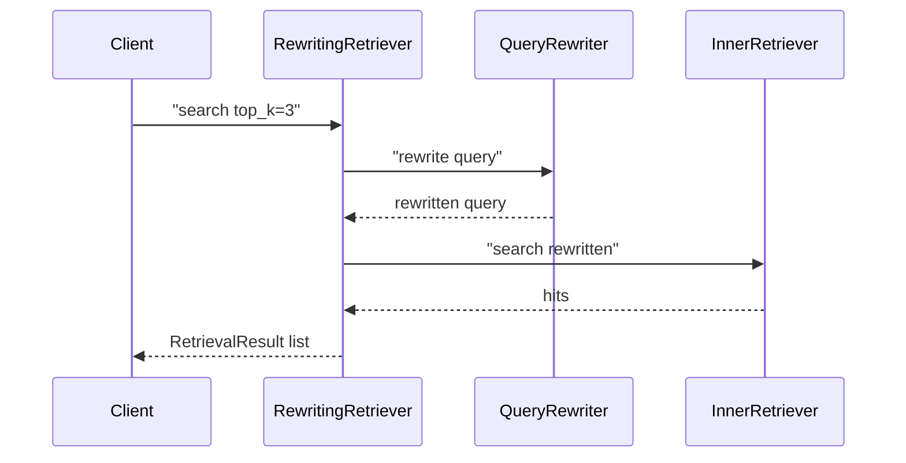
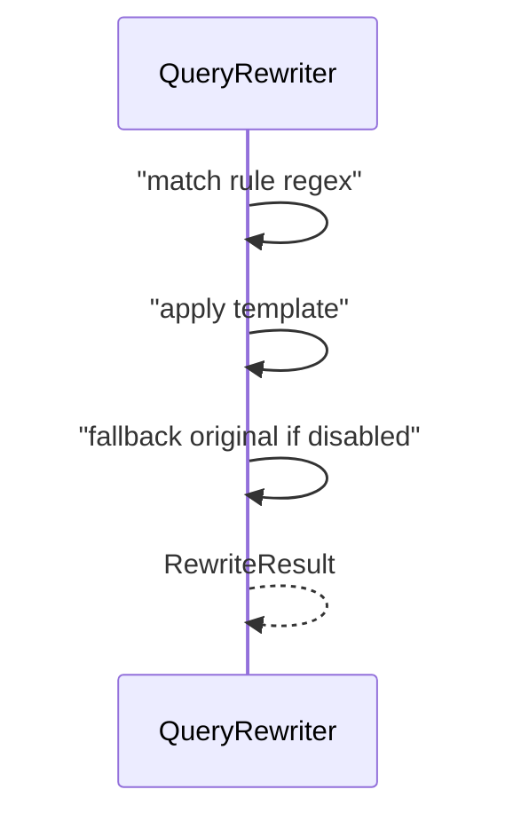

# Day 33 流程图与示意图

## rewrite search 时序



## RuleBasedQueryRewriter 数据流



## ASCII：三阶段漏斗

```
query ──► Rewrite ──► Hybrid+Rerank ──► top-k ──► LLM
           (规范化)      (检索栈)
```

## API 配置流

```
GET  /rewrite-config  ◄── store.get_rewrite_config()
PUT  /rewrite-config  ──► validate ──► set ──► save()
POST /api/chat       ──► RewritingRetriever
```
