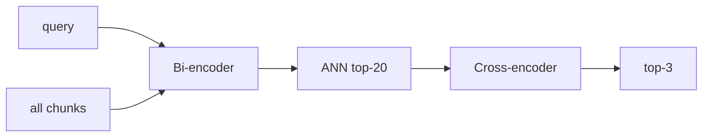

# 查询改写详解（Day 33 专题）

## 1. 问题定义

三阶段检索 = **宽召回**（hybrid top-N）+ **尖改写**（cross-encoder top-k）。Day32 解决「答案在不在候选里」；Day34 解决「谁排第一」。

## 2. Bi-encoder vs Cross-encoder

| 维度 | Bi-encoder（向量） | Cross-encoder（rewrite） |
|------|-------------------|-------------------------|
| 编码 | query、doc 各一次 | (query, doc) 联合 |
| 复杂度 | O(库大小) 可 ANN | O(N) 逐对 |
| 交互 | 无细粒度 token 交互 | 有（真模型 self-attention） |
| 教学 mock | Chroma cosine | rewrite |



## 3. rewrite 公式

1. `query in text` → 1.0（精确子串）  
2. `coverage = |matched tokens| / |query tokens|`  
3. `bigram_bonus = _bigram_overlap(query, text)`  
4. `length_penalty = min(len(text)/2500, 0.12)`  
5. `raw = 0.65*coverage + 0.35*bigram - penalty`，clamp [0,1]

## 4. max_rewrite_len 选型

| pool | 召回风险 | rewrite 成本 |
|------|----------|-------------|
| 10 | 易漏 hybrid 10 名外真答案 | 低 |
| 20 | **默认平衡** | 中 |
| 50 | 边际提升小 | 高 |

公式：`pool = max(max_rewrite_len, top_k)`。

## 5. enabled 开关语义

`enabled=False`：`RewritingRetriever` 直接 `inner.search(top_k)`，零 rewrite 开销，行为等同 Day32。

## 6. 与 LLM 上下文

RAG 通常取 top-3 拼 prompt。口语命中 决定「第一条引用」展示；rewrite 直接优化用户可见的首条来源。

## 7. 常见误区

| 误区 | 正解 |
|------|------|
| rewrite 替代 hybrid | 是外包层，inner 仍是 hybrid |
| rewrite 分可与 hybrid 分比 | 仅排序用，标度不同 |
| pool 越大越好 | 延迟线性，收益递减 |

## 8. 数学例题

候选 A：长政策文，hybrid score 0.95，rewrite 0.2。候选 B：短 FAQ，hybrid 0.4，rewrite 0.85。rewrite 后 **B 胜**。

## 9. 课堂演示

运行 rewrite_demo，对比「年化收益率可达」双列。

## 10. 小结

Rewrite 三层含义：**漏斗第二截**、**query-chunk 细交互**、**可配置 SLA**（pool / enabled）。

---

## 11. 工作负载特征

| 操作 | 次数/请求 |
|------|-----------|
| hybrid search | 1 |
| rewrite | ≤ pool |
| sort | O(pool log pool) |

---

## 12. 生产演进路线

Phase 3 Day34：MockCrossEncoder  
Phase 4：ONNX / HF `BAAI/bge-rewriteer-base`  
Phase 5：GPU batch rewrite

---

## 13. 与 ColBERT 边界

ColBERT late interaction 介于 bi 与 cross 之间；本课不展开，记为延伸阅读。

---

## 14. 监控指标建议

- `rag_rewrite_pool_size`  
- `rag_rewrite_latency_ms`  
- `rag_hit_at_1`（离线）  

---

## 15. 源码锚点

```python
"""
Rewriting 检索管线 — 查询改写 → hybrid → rerank

需求：ZL-NA-REQ-033
"""

from __future__ import annotations

from rag.query_rewriter import QueryRewriter, RewriteResult, RuleBasedQueryRewriter
from rag.rewrite_config import RewriteConfig
from rag.retriever import RetrievalResult


class RewritingRetriever:
    """
    最外层检索装饰器 — 先改写 query，再委托内层检索

    典型用法：
        inner = RerankingRetriever(HybridRetriever(...))
        retriever = RewritingRetriever(inner, config=RewriteConfig())
        hits = retriever.search("那个理财能赚多少", top_k=3)
    """

    def __init__(
        self,
        inner,
        *,
        rewriter: QueryRewriter | None = None,
        config: RewriteConfig | None = None,
    ) -> None:
        self._inner = inner
        self._config = config or RewriteConfig()
        self._rewriter = rewriter or RuleBasedQueryRewriter(config=self._config)
        self._last_rewrite: RewriteResult | None = None

    @property
    def inner(self):
        return self._inner

    @property
    def config(self) -> RewriteConfig:
        return self._config

    @property
    def last_rewrite(self) -> RewriteResult | None:
        """最近一次 search 的改写结果（演示 / 审计）"""
        return self._last_rewrite

    @property
    def chunk_count(self) -> int:
        return getattr(self._inner, "chunk_count", 0)

    def search(
        self,
        query: str,
        *,
        top_k: int = 3,
        rewrite_override: bool | None = None,
    ) -> list[RetrievalResult]:
        query = (query or "").strip()
        if not query:
            self._last_rewrite = None
            return []

        cfg = self._config
        enabled = rewrite_override if rewrite_override is not None else cfg.enabled
        if not enabled:
            self._last_rewrite = RewriteResult(
                original=query, rewritten=query, changed=False
            )
            return self._inner.search(query, top_k=top_k)

        result = self._rewriter.rewrite(query)
        self._last_rewrite = result
        search_q = result.rewritten or query
        return self._inner.search(search_q, top_k=top_k)
```


---

## 16. 合规场景

风险提示类 query 须保证 top-1 来自披露原文 — rewrite 的 length_penalty 降低「长文堆砌关键词」霸榜。

---

## 17. 课堂练习题

手算：query「年化」，text「本产品年化收益率可达 8%」，无完整子串，估算 coverage 与最终排序倾向。

---

## 18. 术语表

| 术语 | 含义 |
|------|------|
| 口语命中 | top-1 是否含期望 token |
| max_rewrite_len | hybrid 召回条数上限 |
| cross-encoder | 联合编码打分模型 |

---

## 19. 反模式

- 全库 cross-encode  
- pool=1 仍开 rewrite  
- 不 invalidate RAG cache 改配置  

---

## 20. 金句

「召回负责不漏，改写负责不错；Day34 专治第一条。」

---

## 21. 延迟 SLA 案例表

| 场景 | pool | rewrite ms | 决策 |
|------|------|-----------|------|
| 普通 FAQ | 20 | 10 | 默认 |
| 高峰降级 | 10 | 5 | enabled 保持 |
| 事故 | — | 0 | enabled=false |

---

## 22. 与 evaluate API 关系

`/api/knowledge/evaluate` 仍隔离 chunk_config；rewrite 评估应另建 口语命中 脚本，避免变量混淆。

---

## 23. 学员常见笔试错答

「rewrite 用向量」— 错，用 rewrite mock cross。  
「pool 越大 口语命中 越高」— 错，边际递减且延迟升。
