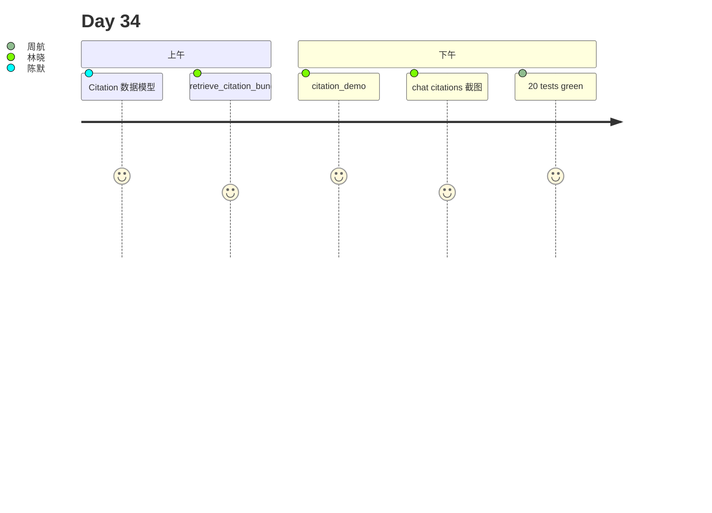

# Day 34 旁白解读

2026 年 8 月 10 日，星期一。林晓收到合规部邮件：「客服回答正确，但**无法证明引用来源**——审计要求每条 RAG 回复附带可追溯 chunk。」

赵岩在白板画出完整管线：

```
rewrite → hybrid → rerank → citations[] → LLM
                              ↑ 今日
```

陈默：「Day 33 让问句更准；今天让**回答有据可查**。`CitationBuilder` 把 top-k 检索结果变成 `citations[]`：`source`、`score`、`preview`、`chunk_id`。」

下午 Lab，林晓跑 `citation_demo.py`：

```
Q: 年化收益率是多少
  rewrite: '年化收益率是多少'
  [1] raw_notice.txt score=0.92 本产品年化收益率可达 8%…
```

周航：「这和 chat 里的 reply 啥关系？」陈默：「reply 是 LLM 生成；citations 是检索证据——**面子与里子**。」

第四节，她 `PUT /api/knowledge/citation-config` 设 `include_rewrite_meta=false`，前端不再展示改写审计；合规只关心 source。



**金句**：陈默：「可解释 RAG 不是让模型多说废话，是让每条断言能点到 chunk。」

---

## 技术旁白：max_citations 为何默认 3

`CitationConfig.max_citations=3` 与 rerank `top_k=3` 对齐：LLM 上下文通常取 3 条；UI 展示过多引用会淹没 reply。`preview_max_chars=120` 在移动端一屏可读。

---

## 现场对话（转写节选）

**学员**：关 citations 会影响检索吗？  
**陈默**：不会，只影响展示；`enabled=false` 时 chat 仍正常，只是 `citations=[]`。

**学员**：rewrite 元数据必须展示吗？  
**陈默**：`include_rewrite_meta` 可关；合规场景常开，面向用户可关。

---

## 林晓日记节选

「终于把检索漏斗最后一截接上——用户能看到『依据哪条公告』了。」

---

## 时间线

| 时刻 | 事件 |
|------|------|
| 09:00 | 复现「无引用」合规风险 |
| 10:30 | 讲 Citation / CitationBundle |
| 11:00 | **retrieve_citation_bundle 白板** |
| 14:00 | citation_demo |
| 15:00 | citation-config API |
| 16:30 | 20 tests green |

---

## 媒体稿（公关）

智链 NexusAgent v0.34.0 上线引用溯源，RAG 回复可附带结构化 citations，满足金融客服审计与可解释性要求。

---

## 幕后：教研组会议纪要

**议题**：citations 是否默认开启？  
**结论**：`enabled=true`；内网演示可关。  
**行动**：Day35 课件预习 HyDE 多查询扩展。

---

## 学员反馈（试讲）

「chunk_id 能回查 store.json，审计终于闭环。」  
「前端 msg__citations 比想象简单——就是渲染 JSON 数组。」

---

## 彩蛋：电影隐喻

陈默：「检索是取证；citations 是呈堂证供编号。」
