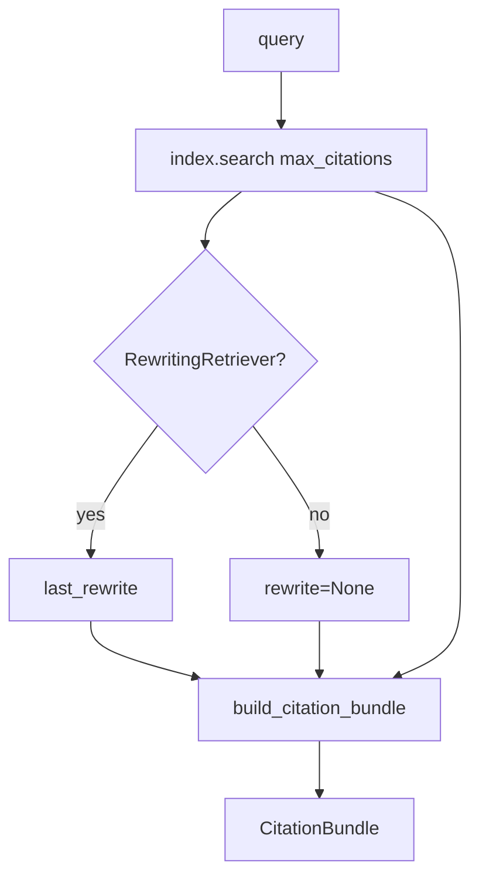
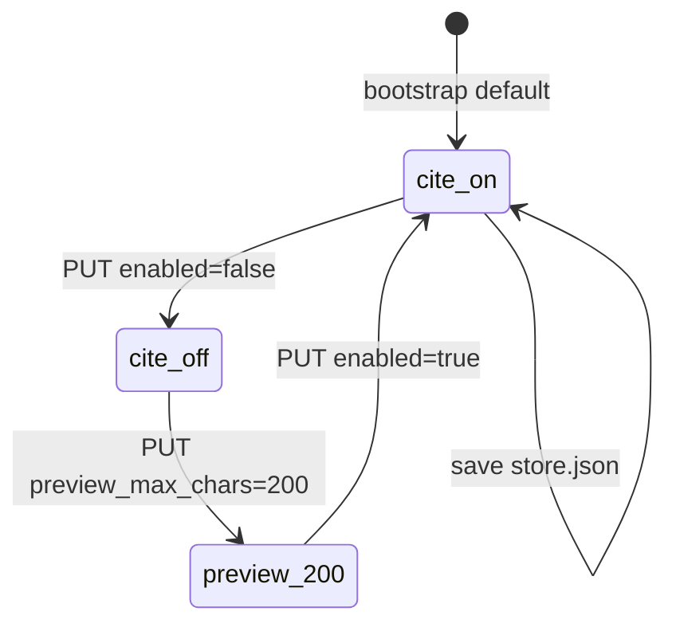
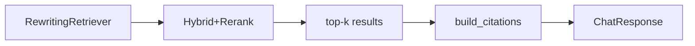

# Day 34 架构设计 — 引用溯源层

## 1. 引用溯源分层

```mermaid
flowchart TD
    CHAT["/api/chat"] --> FETCH[fetch_citations]
    FETCH --> CFG{CitationConfig.enabled?}
    CFG -->|false| EMPTY[citations=[]]
    CFG -->|true| BUNDLE[retrieve_citation_bundle]
    BUNDLE --> SEARCH[index.search top_k]
    SEARCH --> BUILD[build_citation_bundle]
    BUILD --> OUT[citations[] + rewrite]
    PREVIEW["/citation-preview"] --> FETCH
    CC[CitationConfig] --> FETCH
    STORE[(store.json)] --> CC
```

## 2. retrieve_citation_bundle 流程



## 3. 配置生命周期



## 4. 组件职责

| 组件 | 职责 |
|------|------|
| citation_builder.py | Citation / build_citations / CitationBundle |
| context.py | retrieve_citation_bundle |
| citation_config.py | 展示策略 dataclass |
| knowledge_store.fetch_citations | 知识库层封装 |
| api/knowledge citation-* | REST 读写与预览 |
| api/chat.py | reply + citations + rewrite |
| day34/citation_demo.py | CLI 引用打印 |

## 5. 不变量

- `citations` 来自检索 `RetrievalResult`，非 LLM 生成  
- `preview` 为截断展示，不等于 chunk 全文  
- `enabled=false` 不阻止 RAG 检索与 reply 生成  

---

## 6. 与 Day33 叠加



Day33 rewrite 作用于检索；Day34 在检索后格式化引用并可选展示 rewrite 审计。

---

## 7. 数据流：PUT citation-config

1. `CitationConfig.from_dict(body)`  
2. `validate()`  
3. `store.set_citation_config(cfg)`  
4. `store.save()`  

---

## 8. 分层架构图

```
┌─────────────────────────────────────────────┐
│ Presentation: chat + citation-config API    │
├─────────────────────────────────────────────┤
│ Application: KnowledgeStore.fetch_citations │
├─────────────────────────────────────────────┤
│ Domain: retrieve_citation_bundle            │
├─────────────────────────────────────────────┤
│ Domain: build_citations / CitationBundle    │
├─────────────────────────────────────────────┤
│ Infrastructure: Retriever stack (Day31-33)  │
└─────────────────────────────────────────────┘
```
