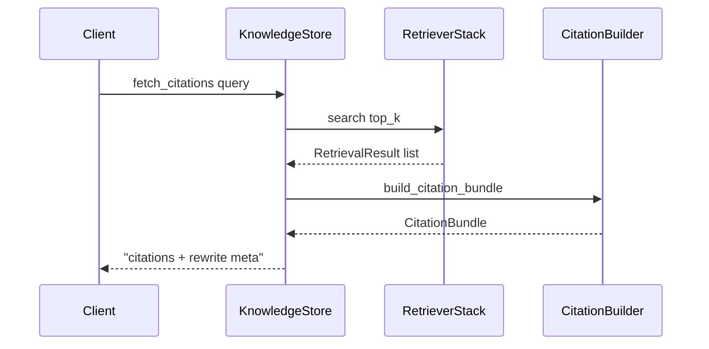
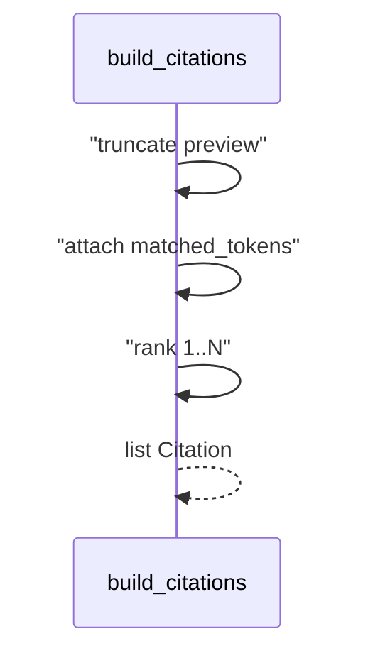

# Day 34 流程图与示意图

## citation 检索时序



## Citation 构建数据流



## ASCII：引用溯源

```
query ──► retrieve ──► build_citations ──► chat citations[]
                              │
                              └── rewrite audit optional
```

## API 配置流

```
GET  /citation-config   ◄── store.get_citation_config()
PUT  /citation-config   ──► validate ──► set ──► save()
POST /citation-preview  ──► fetch_citations
POST /api/chat          ──► reply + citations[]
```
