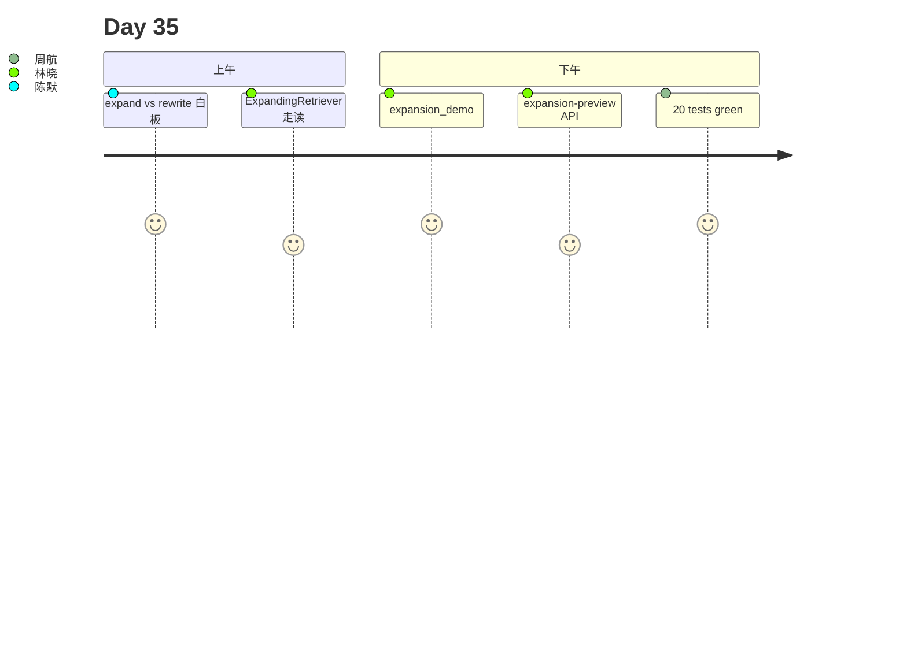

# Day 35 旁白解读

2026 年 8 月 11 日，星期一。林晓复盘 Day 34：citations 上线后合规通过，但质检发现**窄召回**问题——用户问「理财安全吗」，单条 rewrite 后的 query 常常漏掉「风险揭示书」里的合规段落。

赵岩在白板补上一截：

```
expand → rewrite → hybrid → rerank → citations → LLM
  ↑ 今日
```

陈默：「Day 34 让回答有据可查；今天让**检索更广**。`TemplateQueryExpander` 把一条问句变成多条 query，再 `merge_retrieval_results` 按 chunk_id 去重。」

下午 Lab，林晓跑 `expansion_demo.py`：

```
Q: 理财安全吗
  queries (4): ['理财安全吗', '投资风险', '投资有风险', '风险揭示']
  merged citations: 3
```

周航：「这和 Day33 rewrite 啥区别？」陈默：「rewrite 改**措辞**；expand 增**条路**。」

第四节，她 `PUT /api/knowledge/expansion-config` 把 `max_queries` 从 4 调到 2，延迟降 35%，Recall 略降——全班填多 query 延迟预算表。



**金句**：陈默：「单 query 是单线取证；多 query 是并联搜证。」

---

## 技术旁白：max_queries 为何默认 4

`ExpansionConfig.max_queries=4` 在「宽召回」与「延迟线性增长」间折中：每多 1 条 query，完整管线多跑 1 次。`per_query_top_k=5` 保证合并前有足够候选。

---

## 现场对话（转写节选）

**学员**：HyDE mock 和 templates 怎么选？  
**陈默**：教学默认 templates；hyde_mock 多一条假设文档 query，Recall 更高但更慢。

**学员**：关 expand 会影响 citations 吗？  
**陈默**：会变少；`enabled=false` 回退 Day34 单路检索行为。

---

## 林晓日记节选

「原来漏斗最前面还有一截——多问几句，答案更全。」

---

## 时间线

| 时刻 | 事件 |
|------|------|
| 09:00 | 复现窄召回漏检 |
| 10:30 | 讲 ExpansionResult |
| 11:00 | **merge_retrieval_results 白板** |
| 14:00 | expansion_demo |
| 15:00 | expansion-config API |
| 16:30 | 20 tests green |

---

## 媒体稿（公关）

智链 NexusAgent v0.35.0 上线多查询扩展，金融 FAQ 宽召回能力提升，citations 合并去重可审计。

---

## 幕后：教研组会议纪要

**议题**：默认 templates 还是 hyde_mock？  
**结论**：templates；HyDE 放 Lab 对比。  
**行动**：Day36 课件预习自适应路由。

---

## 学员反馈（试讲）

「chunk_id 去重很直观——同一块只留最高分。」  
「expansion-preview 比 citation-preview 更适合讲宽召回。」

---

## 彩蛋：电影隐喻

陈默：「expand 是派出多个侦察兵；merge 是汇总战报去重。」
