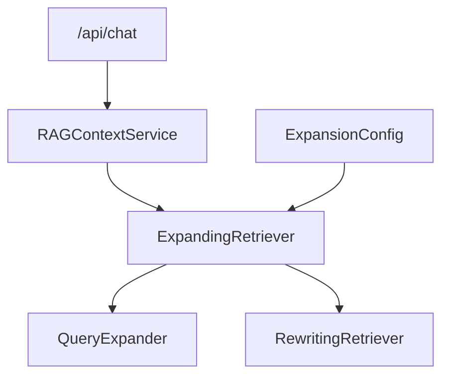

# Day 35 架构设计 — 多查询扩展层

## 1. 扩展分层

## 2. 组件

| 组件 | 职责 |
|------|------|
| query_expander.py | 单 query → 多 query |
| expanding_retriever.py | 多路 search + merge |
| result_merger.py | chunk_id 去重 |
