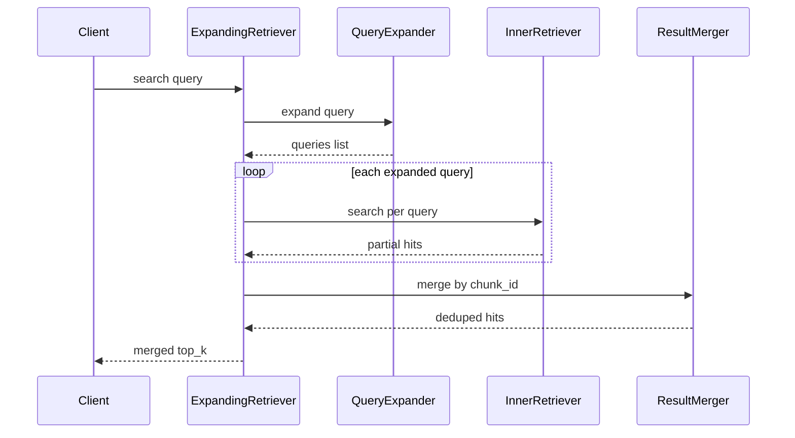
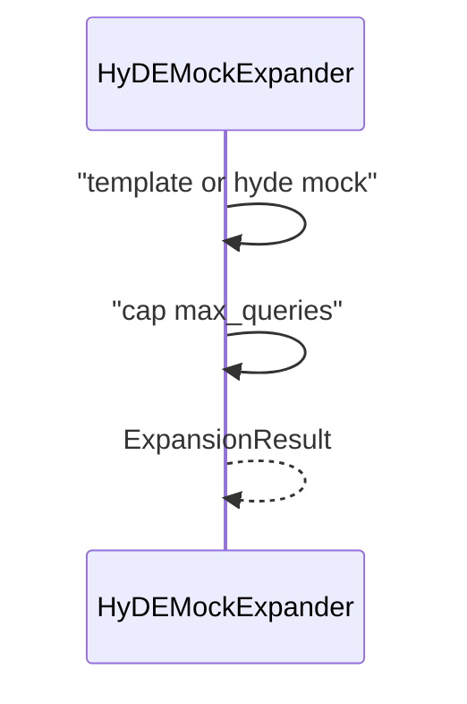

# Day 35 流程图与示意图

## expansion search 时序



## HyDE 扩展数据流



## ASCII：多路召回

```
query ──► expand ──► q1,q2,q3 ──► parallel search ──► merge ──► top-k
```

## API 配置流

```
GET  /expansion-config   ◄── store.get_expansion_config()
PUT  /expansion-config   ──► validate ──► set ──► save()
POST /expansion-preview  ──► expand query
POST /api/chat           ──► expansion audit + citations
```
