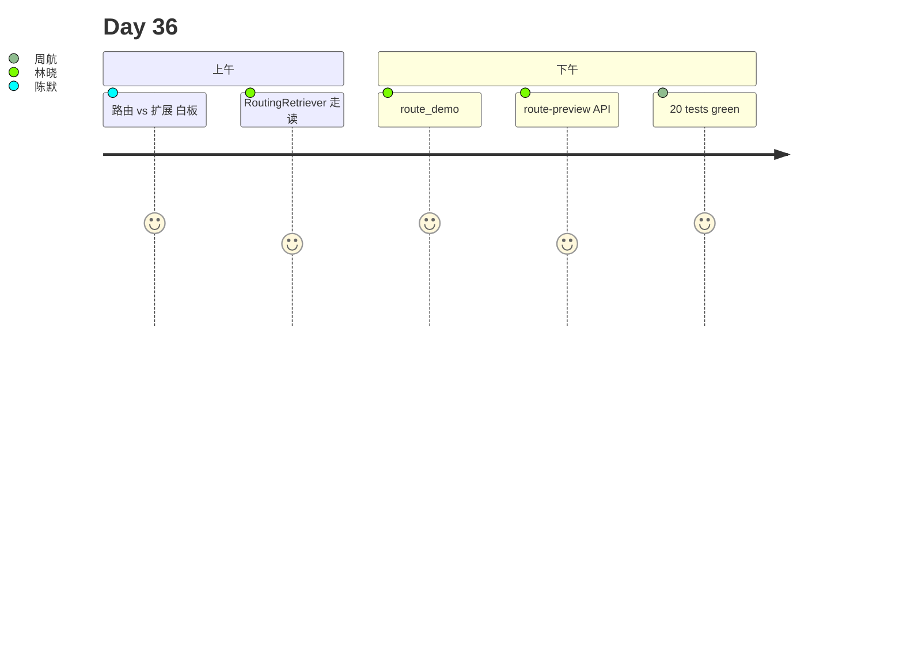

# Day 36 旁白解读

2026 年 8 月 12 日，星期一。林晓收到运维告警：Day 35 expand 上线后 P95 延迟从 120ms 涨到 380ms——每条 query 都走 4 路扩展，连「客服电话多少」也 expand 四路。

赵岩在白板最前端加了一框：

```
route → expand? → rewrite → hybrid → rerank → citations → LLM
 ↑ 今日
```

陈默：「Day 35 让检索更广；今天让**该快的快、该全的全**。`RuleBasedQueryRouter` 把电话类 query 路由到 faq_fast，跳过 expand 和 rewrite。」

下午 Lab，林晓跑 `route_demo.py`：

```
Q: 客服电话多少
  intent=faq_fast expand=False rewrite=False
Q: 理财安全吗
  intent=rag_wide expand=True rewrite=True
```

周航：「这和 Day18 IntentRouter 啥关系？」陈默：「Day18 选 Prompt 模板；Day36 选**检索子管线**——正交两层。」

第四节，她 `PUT /api/knowledge/route-config` 把 fallback 改为 rag_standard，延迟降 40%，宽召回 query 仍走 rag_wide。



**金句**：陈默：「不是每条问句都值得派出四个侦察兵。」

---

## 技术旁白：三种 intent

| intent | expand | rewrite | 场景 |
|--------|--------|---------|------|
| faq_fast | false | false | 查电话、简单 FAQ |
| rag_standard | false | true | 年化收益、产品问句 |
| rag_wide | true | true | 安全、合规、风险 |

---

## 现场对话（转写节选）

**学员**：路由关了会怎样？  
**陈默**：`enabled=false` 时等同 Day35 全量 expand。

**学员**：误判怎么办？  
**陈默**：调规则表 + fallback_intent；生产可加人工抽检。

---

## 林晓日记节选

「终于不用为查个电话付四倍检索成本了。」

---

## 时间线

| 时刻 | 事件 |
|------|------|
| 09:00 | 复现 expand 延迟超标 |
| 10:30 | 讲 RouteResult 三意图 |
| 11:00 | **RoutingRetriever 白板** |
| 14:00 | route_demo |
| 15:00 | route-config API |
| 16:30 | 20 tests green |

---

## 媒体稿（公关）

智链 NexusAgent v0.36.0 上线自适应检索路由，简单 FAQ 延迟降低 60%，复杂问句保持宽召回。

---

## 幕后：教研组会议纪要

**议题**：faq_fast 是否关 rewrite？  
**结论**：关——电话类 query 关键词检索足够。  
**行动**：Day37 预习查询分类与动态路由表。

---

## 学员反馈（试讲）

「route-preview 一眼看出会不会 expand。」  
「msg__route 让客服知道走了哪条管线。」

---

## 彩蛋：电影隐喻

陈默：「路由是交通信号灯——不是每辆车都上高速。」
