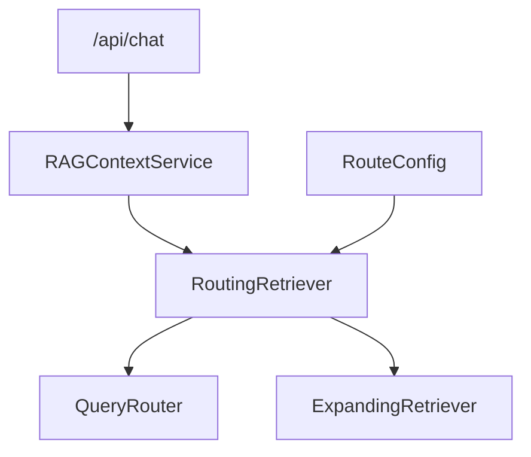

# Day 36 架构设计 — 自适应路由层

## 1. 路由分层

```mermaid
flowchart TD
    CHAT["/api/chat"] --> RAG[RAGContextService]
    RAG --> RT[RoutingRetriever]
    RT --> QR[QueryRouter]
    RT --> EXP[ExpandingRetriever]
    CFG[RouteConfig] --> RT
```

## 2. intent 表

| intent | expand | rewrite |
|--------|--------|---------|
| faq_fast | off | off |
| rag_standard | off | on |
| rag_wide | on | on |
