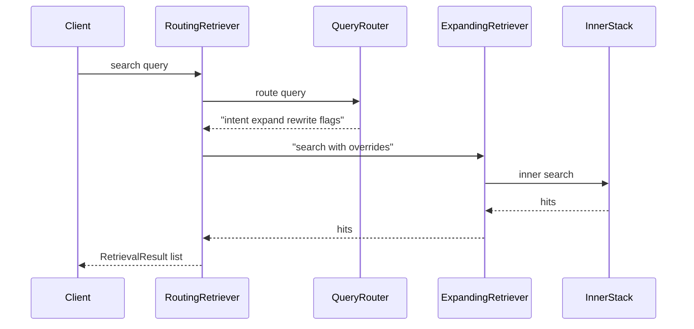
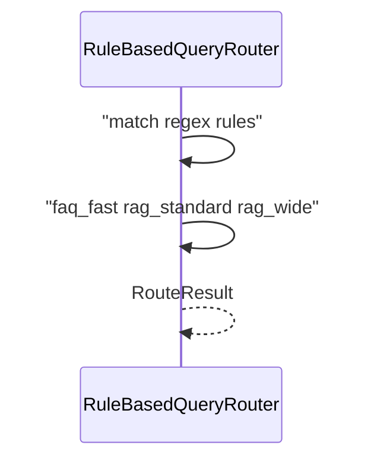

# Day 36 流程图与示意图

## route search 时序



## 意图路由数据流



## ASCII：快慢路径

```
query ──► route ──► expand? ──► rewrite? ──► hybrid ──► rerank
          faq_fast     off          off
          rag_wide     on           on
```

## API 配置流

```
GET  /route-config   ◄── store.get_route_config()
PUT  /route-config   ──► validate ──► set ──► save()
POST /route-preview  ──► intent preview
POST /api/chat       ──► route audit + citations
```
