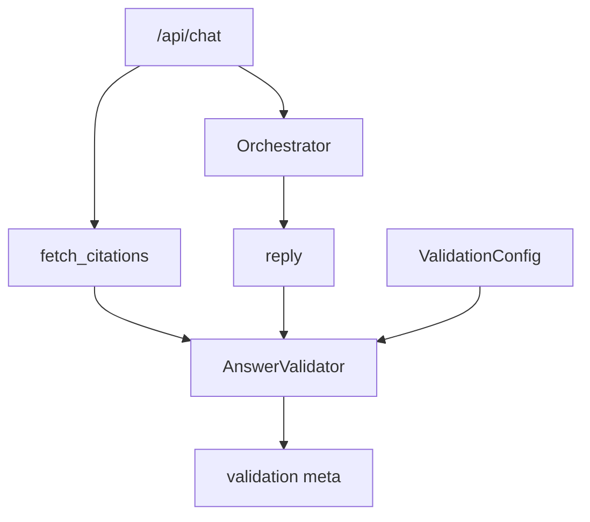

# Day 37 架构设计 — Self-RAG 答案校验层

## 1. 校验分层

```mermaid
flowchart TD
    CHAT["/api/chat"] --> ORCH[Orchestrator]
    ORCH --> REPLY[reply]
    CHAT --> CITE[fetch_citations]
    CITE --> VAL[AnswerValidator]
    REPLY --> VAL
    VAL --> OUT["validation meta"]
    CFG[ValidationConfig] --> VAL
```
