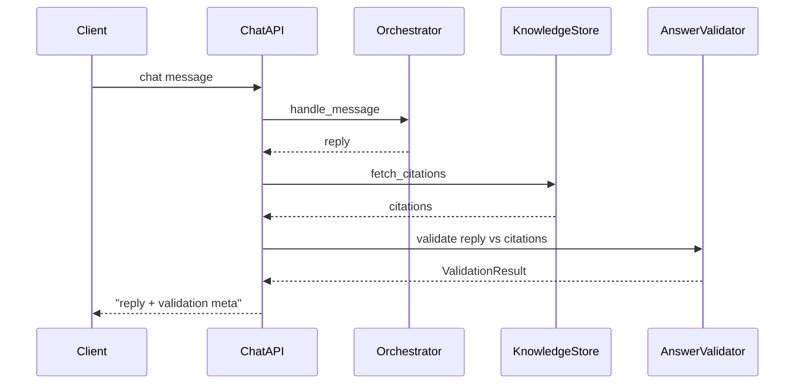
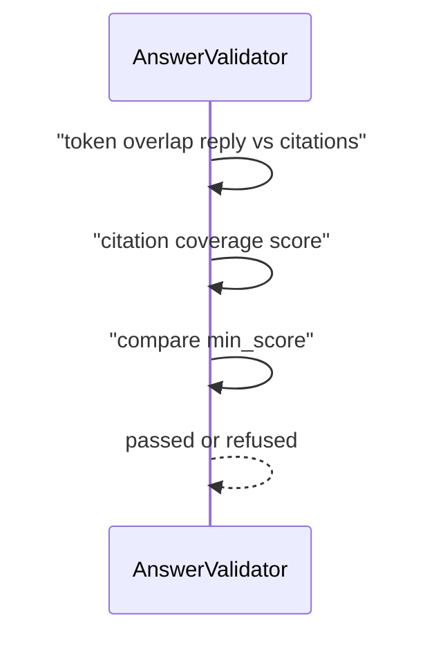

# Day 37 流程图与示意图

## validation 时序



## RuleBasedAnswerValidator 数据流



## ASCII：Self-RAG 后置校验

```
route ──► ... ──► citations ──► LLM ──► validate ──► user
                                      ↑ 今日
```

## API 配置流

```
GET  /validation-config   ◄── store.get_validation_config()
PUT  /validation-config   ──► validate ──► set ──► save()
POST /validation-preview  ──► score query+reply
POST /api/chat            ──► validation audit
```
