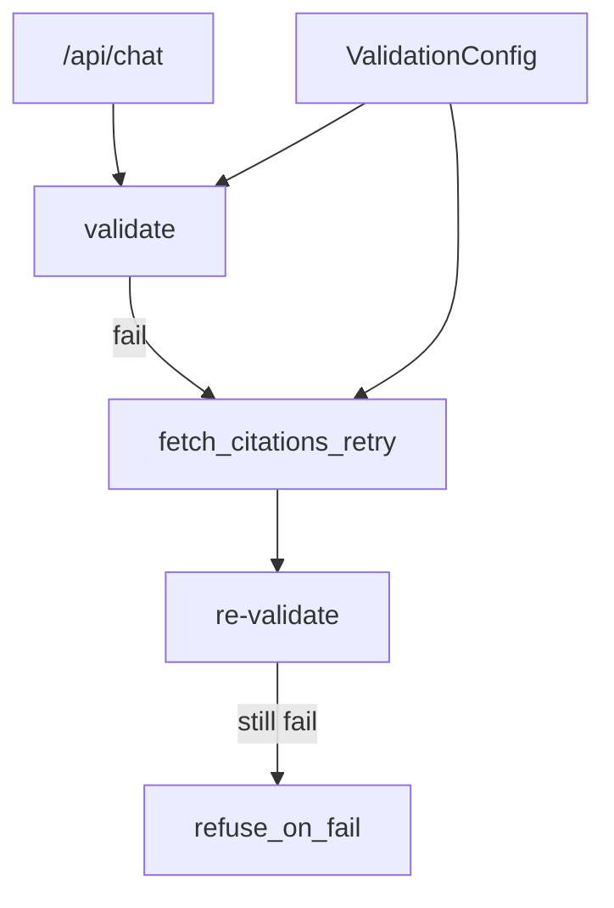

# Day 38 架构设计 — 多轮 Self-RAG 校验重试

## 1. 重试分层

## 2. 组件

| 组件 | 职责 |
|------|------|
| validation_retry.py | apply_validation_retry 循环 |
| fetch_citations_retry | 强制 rag_wide + pool boost |
| RoutingRetriever | intent_override 宽召回 |
