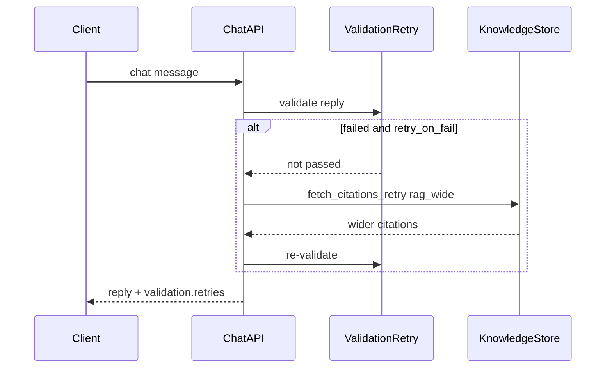

# Day 38 流程图与示意图

## validation retry 时序



## ASCII：重试决策

```
validate ──► passed? ──yes──► return
              │
              no + retry_on_fail
              ▼
         fetch_citations_retry
              ▼
         re-validate ──► refuse_on_fail?
```

## API 配置流

```
PUT  /validation-config      retry_on_fail max_retries
POST /validation-retry-preview  模拟重试
POST /api/chat               validation.retries retry_route
```
