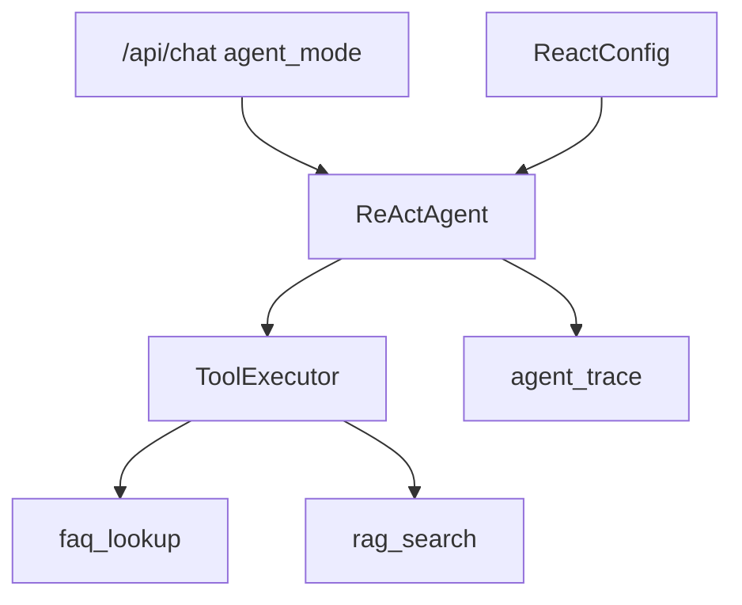

# Day 39 架构设计 — 手写 ReAct Agent

```mermaid
flowchart TD
    CHAT["/api/chat agent_mode"] --> RA[ReActAgent]
    RA --> TE[ToolExecutor]
    TE --> FAQ[faq_lookup]
    TE --> RAG[rag_search]
    RA --> TRACE["agent_trace"]
    CFG[ReactConfig] --> RA
```
