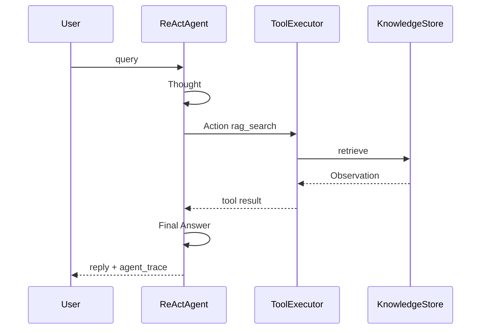

# Day 39 流程图与示意图

## ReAct 时序


```mermaid
sequenceDiagram
    participant U as User
    participant A as ReActAgent
    participant T as ToolExecutor
    participant KB as KnowledgeStore
    U->>A: query
    A->>A: Thought
    A->>T: Action rag_search
    T->>KB: retrieve
    KB-->>T: Observation
    T-->>A: tool result
    A->>A: Final Answer
    A-->>U: reply + agent_trace
```

## API

```
GET/PUT /api/agent/react-config
POST    /api/agent/react-preview
POST    /api/chat  agent_mode=true
```
