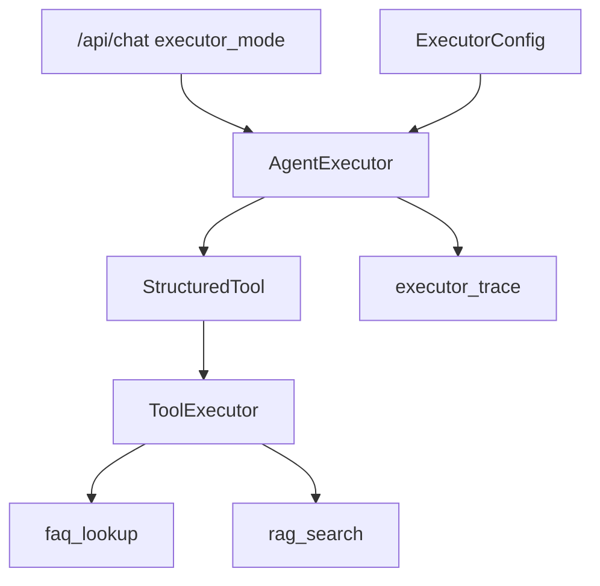

# Day 40 架构设计

## 模块

| 模块 | 职责 |
|------|------|
| structured_tool.py | @tool + OpenAI schema |
| tool_adapter.py | ToolRegistry → StructuredTool |
| agent_executor.py | invoke 循环 + mock planner |
| executor_config.py | max_iterations 等 |

