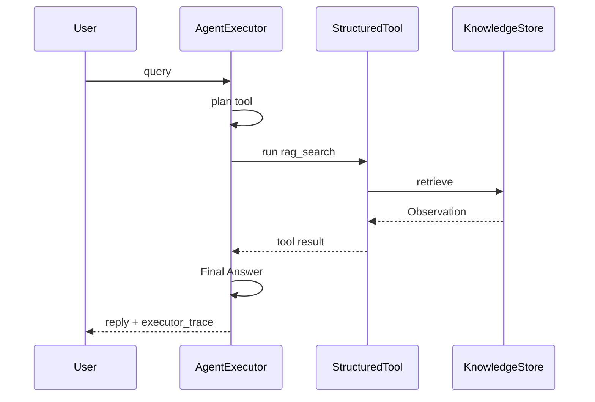

# Day 40 流程图与示意图

## AgentExecutor 时序


```mermaid
sequenceDiagram
    participant U as User
    participant E as AgentExecutor
    participant S as StructuredTool
    participant KB as KnowledgeStore
    U->>E: query
    E->>E: plan tool
    E->>S: run rag_search
    S->>KB: retrieve
    KB-->>S: Observation
    S-->>E: tool result
    E->>E: Final Answer
    E-->>U: reply + executor_trace
```

## API

```
GET/PUT /api/agent/executor-config
POST    /api/agent/executor-preview
POST    /api/chat  executor_mode=true
```
