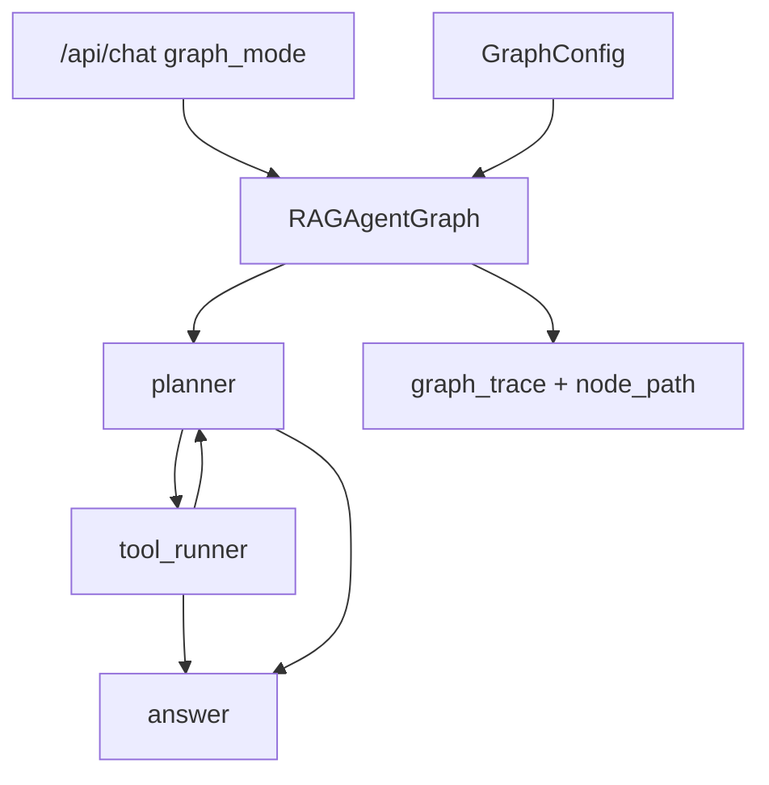

# Day 41 架构设计

## 模块

| 模块 | 职责 |
|------|------|
| state_graph.py | add_node / compile / invoke |
| graph_state.py | AgentGraphState 共享状态 |
| rag_agent_graph.py | planner → tool_runner → answer |
| graph_config.py | max_iterations 等 |

