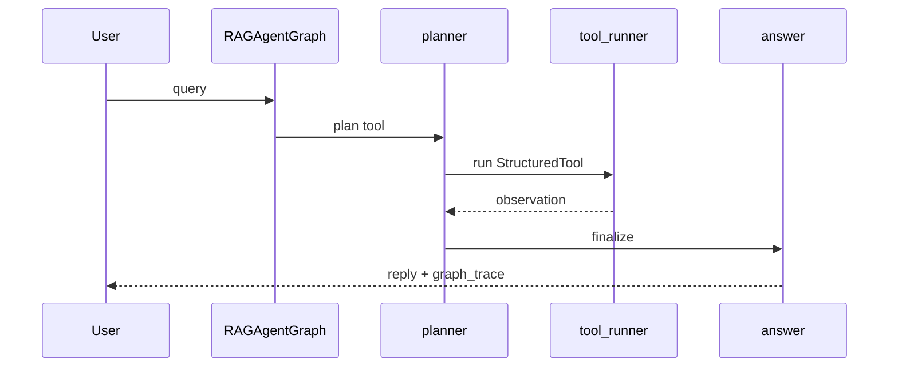

# Day 41 流程图与示意图

## StateGraph 时序


```mermaid
sequenceDiagram
    participant U as User
    participant G as RAGAgentGraph
    participant P as planner
    participant T as tool_runner
    participant A as answer
    U->>G: query
    G->>P: plan tool
    P->>T: run StructuredTool
    T-->>P: observation
    P->>A: finalize
    A-->>U: reply + graph_trace
```

## API

```
GET/PUT /api/agent/graph-config
POST    /api/agent/graph-preview
POST    /api/chat  graph_mode=true
```
