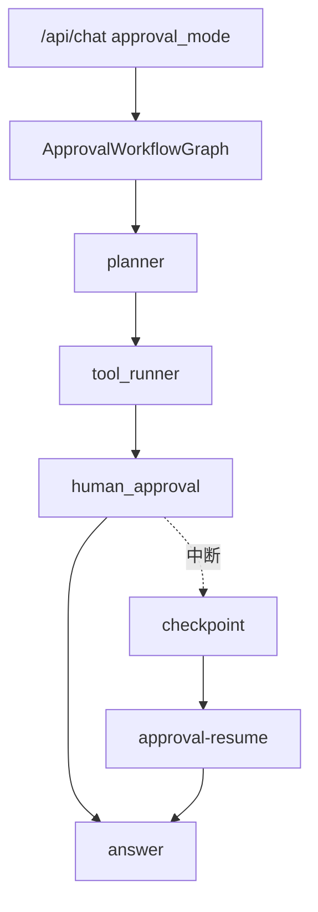

# Day 42 架构设计

## 模块

| 模块 | 职责 |
|------|------|
| approval_config.py | RAG 审批策略 |
| approval_checkpoint.py | 中断状态持久化 |
| approval_workflow_graph.py | human_approval 节点 |

```mermaid
flowchart TD
    CHAT["/api/chat approval_mode"] --> AW[ApprovalWorkflowGraph]
    AW --> P[planner]
    P --> T[tool_runner]
    T --> H[human_approval]
    H --> A[answer]
    H -.中断.-> CP[checkpoint]
    CP --> RESUME[approval-resume]
    RESUME --> A
```
