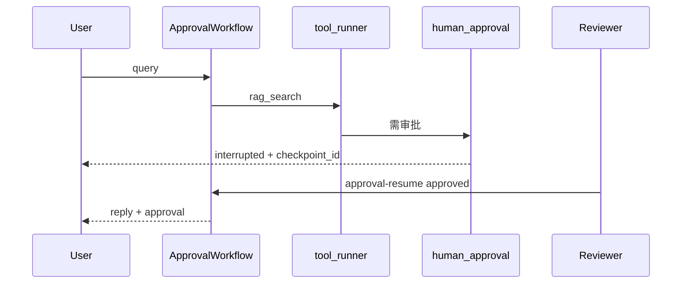

# Day 42 流程图与示意图

## 人工审批时序


```mermaid
sequenceDiagram
    participant U as User
    participant W as ApprovalWorkflow
    participant T as tool_runner
    participant H as human_approval
    participant R as Reviewer
    U->>W: query
    W->>T: rag_search
    T->>H: 需审批
    H-->>U: interrupted + checkpoint_id
    R->>W: approval-resume approved
    W-->>U: reply + approval
```

## API

```
GET/PUT /api/agent/approval-config
POST    /api/agent/approval-preview
POST    /api/agent/approval-resume
POST    /api/chat  approval_mode=true
```
