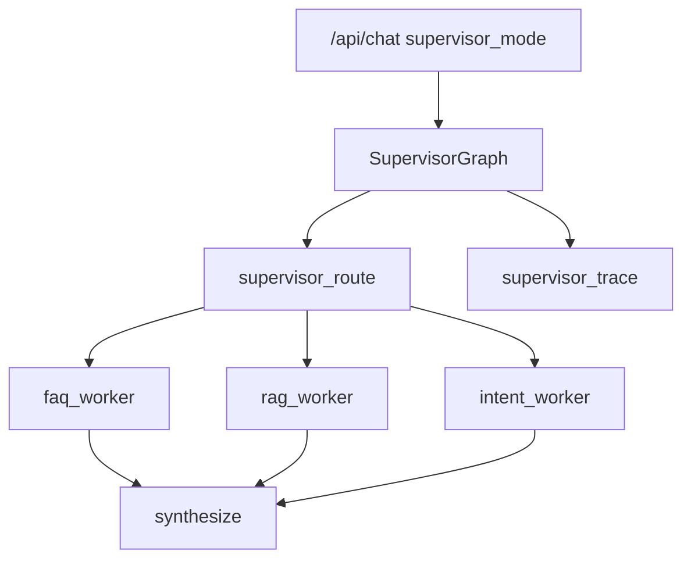

# Day 43 架构设计

## 模块

| 模块 | 职责 |
|------|------|
| supervisor_config.py | 委派策略 |
| sub_agent.py | 三专职子 Agent |
| supervisor_graph.py | route → worker → synthesize |

```mermaid
flowchart TD
    CHAT["/api/chat supervisor_mode"] --> SG[SupervisorGraph]
    SG --> R[supervisor_route]
    R --> F[faq_worker]
    R --> G[rag_worker]
    R --> I[intent_worker]
    F --> S[synthesize]
    G --> S
    I --> S
    SG --> TRACE["supervisor_trace"]
```
