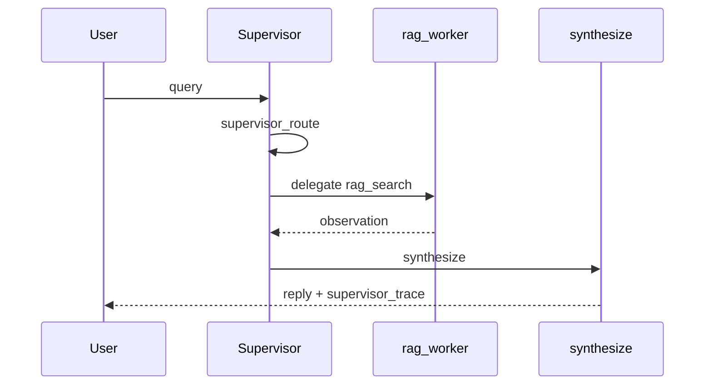

# Day 43 流程图与示意图

## Supervisor 委派时序


```mermaid
sequenceDiagram
    participant U as User
    participant S as Supervisor
    participant W as rag_worker
    participant Y as synthesize
    U->>S: query
    S->>S: supervisor_route
    S->>W: delegate rag_search
    W-->>S: observation
    S->>Y: synthesize
    Y-->>U: reply + supervisor_trace
```

## API

```
GET/PUT /api/agent/supervisor-config
POST    /api/agent/supervisor-preview
POST    /api/chat  supervisor_mode=true
```
