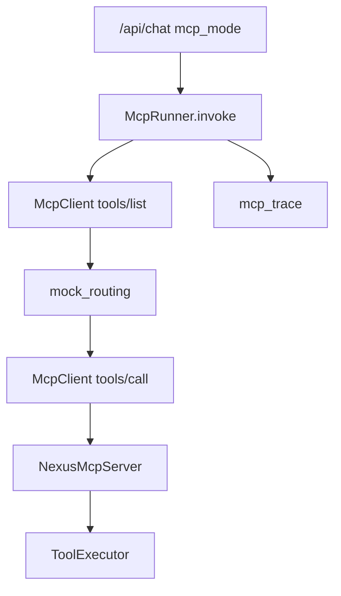

# Day 44 架构设计 — MCP 工具桥接

## 分层


```mermaid
flowchart TD
    CHAT["/api/chat mcp_mode"] --> RUN[McpRunner.invoke]
    RUN --> LIST["McpClient tools/list"]
    LIST --> ROUTE[mock_routing]
    ROUTE --> CALL["McpClient tools/call"]
    CALL --> SRV[NexusMcpServer]
    SRV --> TE[ToolExecutor]
    RUN --> TRACE[mcp_trace]
```

## API

```
GET/PUT /api/agent/mcp-config
POST    /api/agent/mcp-list-tools
POST    /api/agent/mcp-preview
POST    /api/chat  mcp_mode=true
```
