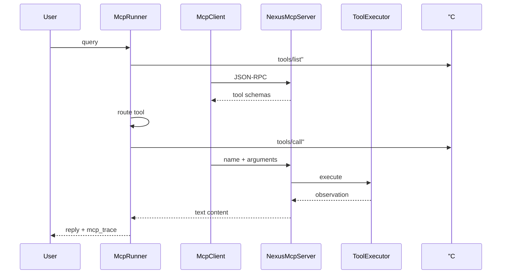

# Day 44 流程图与示意图

## MCP 工具调用时序


```mermaid
sequenceDiagram
    participant U as User
    participant R as McpRunner
    participant C as McpClient
    participant S as NexusMcpServer
    participant T as ToolExecutor
    U->>R: query
    R->> "C: tools/list"
    C->>S: JSON-RPC
    S-->>C: tool schemas
    R->>R: route tool
    R->> "C: tools/call"
    C->>S: name + arguments
    S->>T: execute
    T-->>S: observation
    S-->>R: text content
    R-->>U: reply + mcp_trace
```

## API

```
GET/PUT /api/agent/mcp-config
POST    /api/agent/mcp-list-tools
POST    /api/agent/mcp-preview
POST    /api/chat  mcp_mode=true
```
