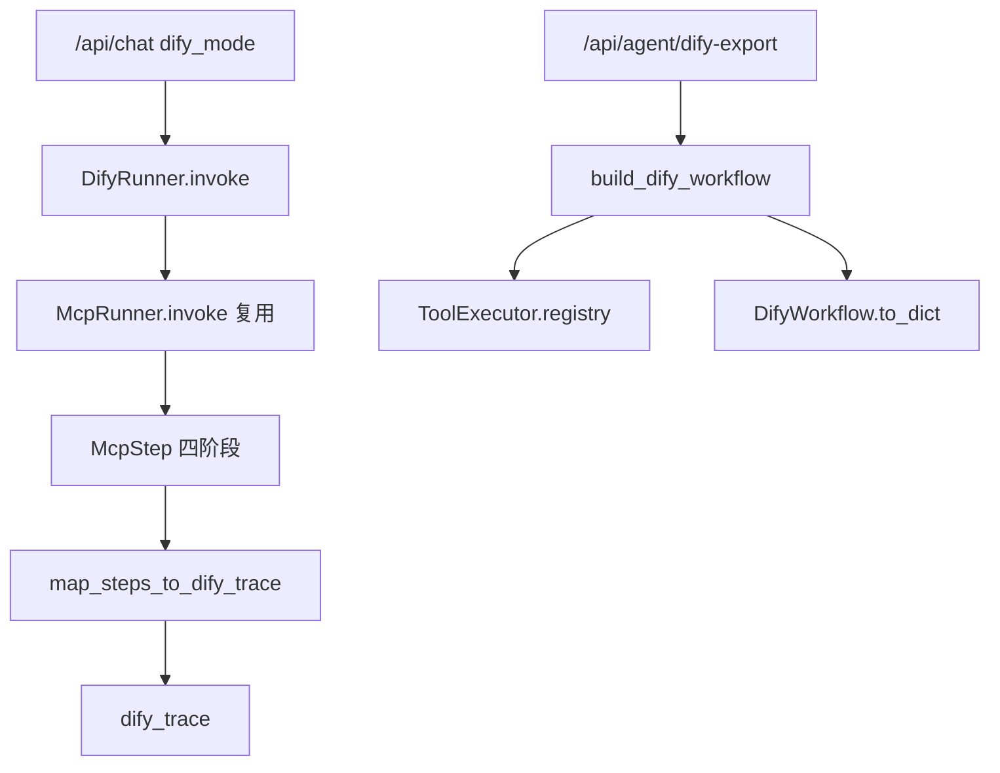
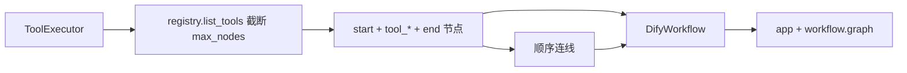
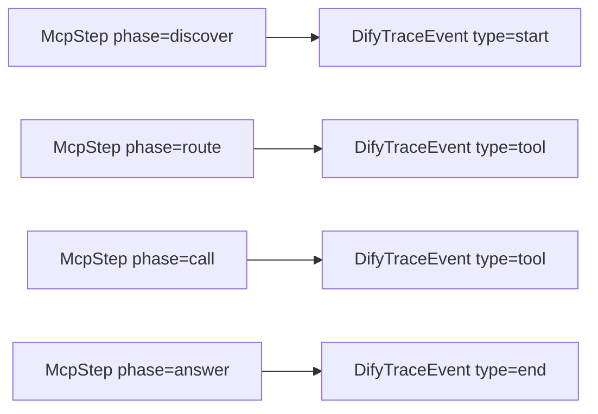
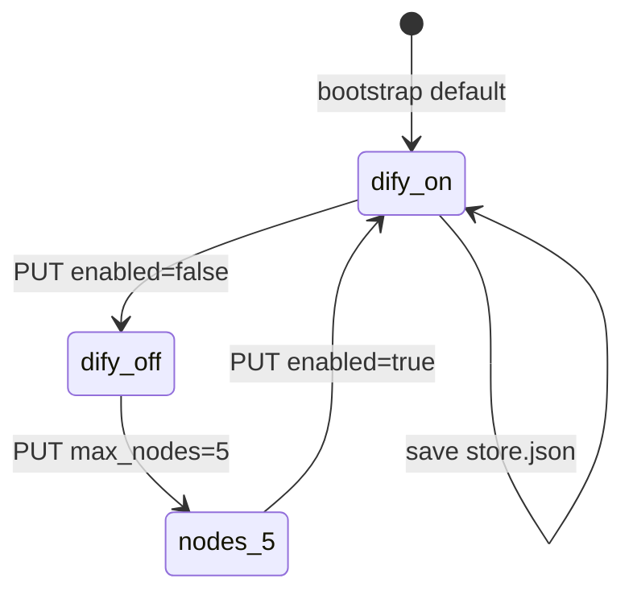
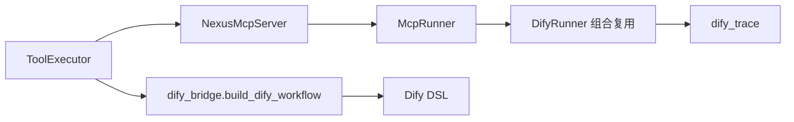

# Day 45 架构设计 — Dify 工作流对接层

## 1. 分层



## 2. 导出流程



## 3. 追踪映射



## 4. 配置生命周期



## 5. 组件职责

| 组件 | 职责 |
|------|------|
| dify_config.py | DifyConfig 数据类 + 校验 |
| dify_protocol.py | DifyNode/DifyEdge/DifyWorkflow/DifyTraceEvent DSL 子集 |
| dify_bridge.py | 纯函数：build_dify_workflow / map_steps_to_dify_trace |
| dify_runner.py | DifyRunner 组合 McpRunner，输出 dify_trace |
| api/agent.py dify-* | REST 读写、导出、预览 |
| api/chat.py | dify_mode 分支 |

## 6. 不变量

- `DifyRunner` 不重复实现工具发现/路由/调用逻辑，全部委托给内部的 `McpRunner`
- 导出的工作流节点顺序与 `ToolRegistry.list_tools()` 的注册顺序一致，具备确定性
- `dify_trace` 事件数恒等于对应 `mcp_trace` 步数（一一映射，不丢不增）

---

## 7. 与 Day44 叠加



Day44 的 MCP 协议解决"外部工具怎么接进来"；Day45 的 Dify 桥接解决"内部工具怎么导出去，给低代码平台用"。

---

## 8. 分层架构图

```
┌─────────────────────────────────────────────┐
│ Presentation: chat + dify-* API              │
├─────────────────────────────────────────────┤
│ Application: DifyRunner                      │
├─────────────────────────────────────────────┤
│ Domain: dify_bridge (build_dify_workflow /    │
│         map_steps_to_dify_trace)              │
├─────────────────────────────────────────────┤
│ Domain: McpRunner（Day44，被复用而非重写）     │
├─────────────────────────────────────────────┤
│ Infrastructure: ToolExecutor / ToolRegistry   │
└─────────────────────────────────────────────┘
```
