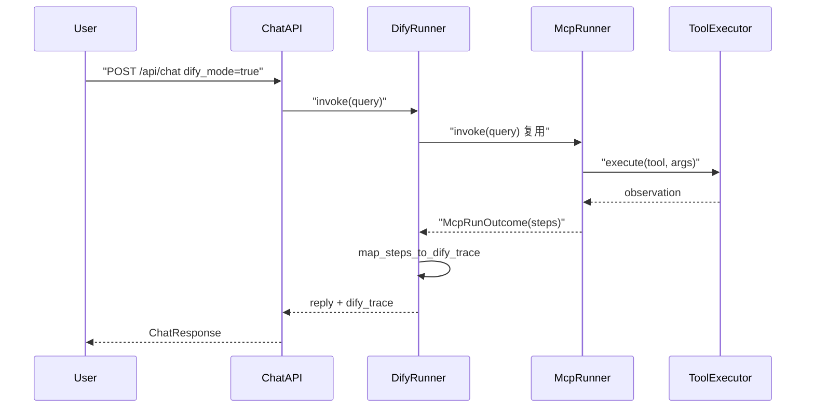
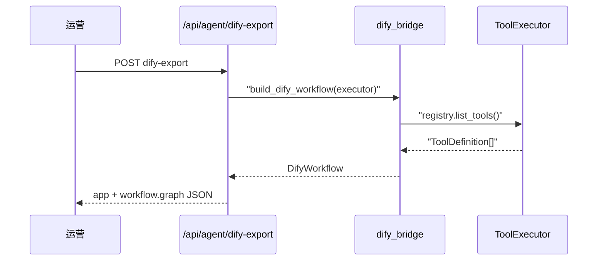

# Day 45 流程图与示意图

## Dify 工作流导出 + 运行追踪时序



## 导出工作流时序



## API

```
GET/PUT /api/agent/dify-config
POST    /api/agent/dify-export
POST    /api/agent/dify-preview
POST    /api/chat  dify_mode=true
```
